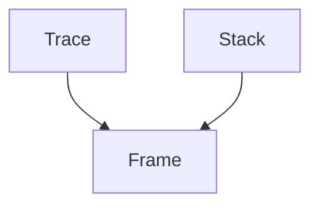

# frame_management Module Documentation

## Introduction

The `frame_management` module is a crucial component within the `rich_traceback` system, specifically focusing on the representation and handling of individual call stack frames. It defines the `Frame` object, which encapsulates detailed information about a single point in the execution stack.

## Core Functionality

The primary function of this module is to provide the `Frame` class. This class serves as a data structure to hold all pertinent information for a single stack frame, such as the file name, line number, function name, and associated code context. This granular representation allows for the precise and detailed display of traceback information.

## Architecture and Component Relationships

As a leaf module within the `rich_traceback` structure, `frame_management` provides a fundamental building block for higher-level traceback components. The `Frame` object is consumed and organized by modules like `trace_handling` (which defines `Trace` objects, a sequence of `Frame`s) and `stack_representation` (which defines `Stack` objects, a collection of `Frame`s or `Trace`s).

<!-- DIAGRAM_JSON
{
    "direction": "TD",
    "nodes": [
        {"id": "frame", "label": "Frame", "type": "component", "link": null},
        {"id": "trace", "label": "Trace", "type": "external", "link": "trace_handling.md"},
        {"id": "stack", "label": "Stack", "type": "external", "link": "stack_representation.md"}
    ],
    "edges": [
        {"source": "trace", "target": "frame"},
        {"source": "stack", "target": "frame"}
    ],
    "groups": []
}
-->

## How It Fits into the Overall System

In the broader context of the Rich library, `frame_management` is integral to the comprehensive and visually rich traceback rendering capabilities. The `Frame` objects created by this module are aggregated into `Trace` objects, which in turn form part of a `Stack` within a `Traceback` ([rich_traceback.md](rich_traceback.md)). This hierarchical structure allows Rich to present detailed and navigable stack traces to users, enhancing debugging and error analysis.

By encapsulating the details of each call frame, `frame_management` enables consistent and accurate display of execution paths, which is critical for developers to quickly identify and resolve issues.
