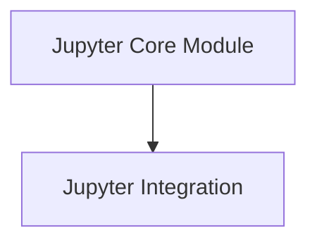

# Jupyter Core Module Documentation

The `jupyter_core` module is a fundamental part of the Rich library's integration with Jupyter environments. It provides core components that enable Rich to render rich content directly within Jupyter notebooks and similar platforms, enhancing the user experience by bringing styled text, tables, and other Rich features to the interactive computing environment.

## Architecture Overview

The `jupyter_core` module is designed to provide seamless integration with Jupyter. It primarily relies on the `jupyter_integration` sub-module, which encapsulates the necessary mixins and renderable interfaces for proper display in Jupyter.

<!-- DIAGRAM_JSON
{
    "direction": "TD",
    "nodes": [
        {"id": "jupyter_integration", "label": "Jupyter Integration", "type": "module", "link": "jupyter_integration.md"}
    ],
    "edges": [],
    "groups": []
}
-->

## Sub-modules

*   **[Jupyter Integration](jupyter_integration.md)**: This sub-module contains the foundational elements for rendering Rich content within Jupyter environments. It includes `JupyterMixin` and `JupyterRenderable` for enabling Rich objects to be displayed correctly.
