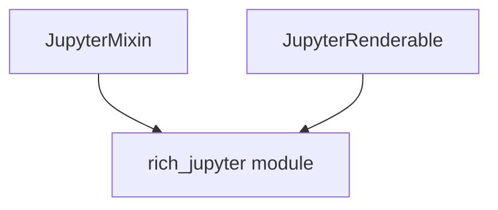

# jupyter_integration Module Documentation

## Introduction
The `jupyter_integration` module provides essential functionalities for integrating Rich's beautiful rendering capabilities directly within Jupyter notebooks and environments. It acts as a bridge, ensuring that Rich's console output, styled text, and renderables are correctly displayed in the rich output cells of Jupyter.

## Core Functionality
This module primarily leverages the `JupyterMixin` and `JupyterRenderable` components from the `rich_jupyter` module to enable a seamless Rich experience in Jupyter.

### JupyterMixin
The `JupyterMixin` is designed to be inherited by Rich objects that need to provide a custom display representation for Jupyter. When an object inheriting `JupyterMixin` is displayed in a Jupyter environment, it can define how it should be rendered, typically by returning a special representation that Jupyter understands (e.g., HTML, Markdown). This ensures that complex Rich objects, like tables or syntax-highlighted code, are presented correctly with their full styling in the notebook.

### JupyterRenderable
`JupyterRenderable` is a type hint or an abstract base class (depending on its exact implementation in `rich_jupyter`) that signifies an object is capable of being rendered in a Jupyter environment. It works in conjunction with `JupyterMixin` to standardize how Rich content is prepared for Jupyter's display system.

## Architecture and Component Relationships

The `jupyter_integration` module is built upon the core definitions found in the `rich_jupyter` module. It serves as the direct consumer and exposer of the `JupyterMixin` and `JupyterRenderable` functionalities. Its primary role is to bundle and make these integration components readily available for use within the larger Rich framework when operating inside a Jupyter context.

<!-- DIAGRAM_JSON
{
    "direction": "TD",
    "nodes": [
        {"id": "jupyter_mixin_node", "label": "JupyterMixin", "type": "component", "link": null},
        {"id": "jupyter_renderable_node", "label": "JupyterRenderable", "type": "component", "link": null},
        {"id": "rich_jupyter_module", "label": "rich_jupyter module", "type": "external", "link": "rich_jupyter.md"}
    ],
    "edges": [
        {"source": "jupyter_mixin_node", "target": "rich_jupyter_module"},
        {"source": "jupyter_renderable_node", "target": "rich_jupyter_module"}
    ],
    "groups": []
}
-->

## How the Module Fits into the Overall System
The `jupyter_integration` module is crucial for Rich's usability in interactive data science and development environments like Jupyter notebooks, JupyterLab, and Google Colab. Without it, Rich's advanced rendering capabilities (like styled text, progress bars, and tables) would either not display correctly or would fall back to plain text representations, diminishing the user experience.

By providing specific components for Jupyter compatibility, `jupyter_integration` ensures that developers can leverage Rich's full potential to create aesthetically pleasing and informative output directly within their notebooks, enhancing readability and user engagement. It acts as a specialized adapter for the Jupyter display protocol, making Rich a first-class citizen in the Jupyter ecosystem.
