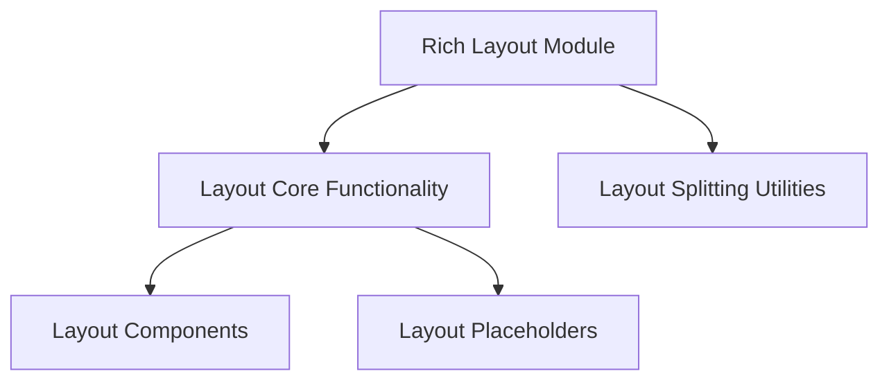

# Layout Components Module

## Introduction

The `layout_components` module is a vital part of Rich's sophisticated layout system, primarily encapsulating the core components for defining and rendering complex terminal layouts. It specifically focuses on the `Layout` class, which serves as the primary container for organizing renderables, and `LayoutRender`, responsible for processing and displaying these layouts.

This module works in conjunction with other components within the `rich_layout` family, providing the building blocks for creating responsive and dynamic terminal user interfaces.

## Architecture Overview

The `layout_components` module is nested within the `layout_core` module, which in turn is a child of the top-level `rich_layout` module. It represents a fundamental layer for defining the structure and rendering mechanisms of layouts, distinct from layout splitting or placeholder management.

<!-- DIAGRAM_JSON
{
    "direction": "TD",
    "nodes": [
        {"id": "rich_layout", "label": "Rich Layout Module", "type": "module", "link": "rich_layout.md"},
        {"id": "layout_core", "label": "Layout Core Functionality", "type": "module", "link": "layout_core.md"},
        {"id": "layout_splitting", "label": "Layout Splitting Utilities", "type": "module", "link": "layout_splitting.md"},
        {"id": "layout_components", "label": "Layout Components", "type": "module", "link": "layout_components.md"},
        {"id": "layout_placeholders", "label": "Layout Placeholders", "type": "module", "link": "layout_placeholders.md"}
    ],
    "edges": [
        {"source": "rich_layout", "target": "layout_core"},
        {"source": "rich_layout", "target": "layout_splitting"},
        {"source": "layout_core", "target": "layout_components"},
        {"source": "layout_core", "target": "layout_placeholders"}
    ],
    "groups": []
}
-->

## Core Functionality

### `rich_layout.Layout`

The `Layout` class is the central component for constructing and managing complex terminal layouts. It allows developers to define a hierarchical structure of regions, each capable of holding various Rich renderables. The `Layout` provides methods for adding, removing, and manipulating these regions, enabling dynamic adjustments to the display based on content or user interaction.

### `rich_layout.LayoutRender`

`LayoutRender` is an internal class responsible for the actual rendering process of a `Layout` instance. It translates the defined layout structure and its contained renderables into a stream of `Segment` objects, which are then displayed on the console. This component handles the intricate details of calculating dimensions, managing content flow, and ensuring proper alignment within the layout's regions.
