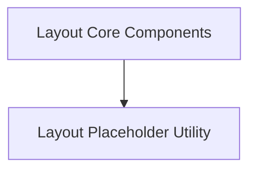

# Layout Core Module Documentation

## Introduction

The `layout_core` module serves as the foundational layer for Rich's powerful layout system. It encapsulates the core classes and logic necessary for defining, structuring, and rendering rich content in a flexible and dynamic manner. This module provides the essential building blocks upon which more specialized layout components and features are built, enabling developers to create complex and responsive terminal UIs.

## Architecture and Component Relationships

The `layout_core` module is central to the `rich_layout` system, providing the fundamental components for layout management. It defines the `Layout` class for hierarchical content arrangement, the `LayoutRender` for orchestrating the rendering process, and the `_Placeholder` for dynamic content insertion. These components are ultimately sourced from the parent `rich_layout` module.

The module's structure supports a clear separation of concerns, with specialized child modules building upon these core components. For instance, [layout_placeholders.md](layout_placeholders.md) focuses specifically on the `_Placeholder` functionality, while [layout_components.md](layout_components.md) leverages both `Layout` and `LayoutRender` to provide broader layout capabilities.

<!-- DIAGRAM_JSON
{
    "direction": "TD",
    "nodes": [
        {"id": "layout_components", "label": "Layout Core Components", "type": "module", "link": "layout_components.md"},
        {"id": "layout_placeholders", "label": "Layout Placeholder Utility", "type": "module", "link": "layout_placeholders.md"}
    ],
    "edges": [
        {"source": "layout_components", "target": "layout_placeholders"}
    ],
    "groups": []
}
-->

## Sub-modules

### [Layout Core Components](layout_components.md)
This sub-module defines the fundamental `Layout` object and its associated `LayoutRender` mechanism. The `Layout` class allows developers to construct complex, responsive terminal interfaces by dividing the screen into a tree of renderable areas. `LayoutRender` is responsible for processing and displaying these layouts efficiently.

### [Layout Placeholder Utility](layout_placeholders.md)
The `layout_placeholders` sub-module introduces the `_Placeholder` component, which serves as a temporary element within a layout. It is particularly useful for dynamically updating parts of the layout, allowing content to be filled in or replaced at runtime.

## How the Module Fits into the Overall System

The `layout_core` module is a fundamental part of the `rich` library's display capabilities. It provides the essential framework for building complex, interactive, and aesthetically pleasing terminal interfaces. It acts as a central hub for the core layout concepts, with other modules extending its functionality:

*   **Parent Module (`rich_layout`)**: The `layout_core` module is a direct child of the [rich_layout module](rich_layout.md), from which its primary components (`Layout`, `LayoutRender`, `_Placeholder`) originate. The `rich_layout` module itself provides broader layout functionalities, including splitting mechanisms, and `layout_core` focuses on the foundational elements.
*   **Child Modules**:
    *   **`layout_placeholders`**: This module ([layout_placeholders.md](layout_placeholders.md)) specializes in managing and utilizing the `_Placeholder` component, offering more refined control over dynamic content areas within a layout.
    *   **`layout_components`**: This module ([layout_components.md](layout_components.md)) extends the functionality of `Layout` and `LayoutRender`, providing higher-level components and utilities for building common layout patterns.
*   **Sibling Module (`layout_splitting`)**: While not a direct child of `layout_core`, the [layout_splitting module](layout_splitting.md) (also a child of `rich_layout`) works in conjunction with the concepts introduced in `layout_core` to enable more advanced division and arrangement of layout regions.

By centralizing these core layout components, `layout_core` ensures consistency and provides a robust foundation for the entire `rich` layout system, allowing for modular development and specialized extensions.