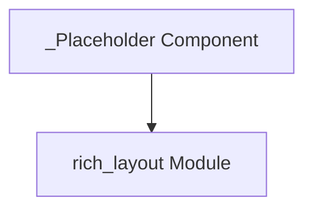

# layout_placeholders

The `layout_placeholders` module is a specialized component within the `rich_layout` ecosystem, primarily focused on providing and managing placeholder elements for the Rich layout system. Its core functionality revolves around the `_Placeholder` component, which serves as a fundamental building block for reserving space and defining structural areas within a dynamic layout.

## Purpose and Core Functionality

The main purpose of `layout_placeholders` is to encapsulate the `_Placeholder` class, which is used to represent empty or content-less regions within a `Layout` object. These placeholders are crucial for:

*   **Layout Definition:** Allowing developers to pre-define the structure of a layout, marking where content will eventually be placed, without needing to populate it immediately.
*   **Dynamic Content Insertion:** Providing a mechanism for dynamically inserting renderable objects into specific named locations within a layout tree.
*   **Space Reservation:** Ensuring that a certain amount of space is reserved in the layout even if its content is not yet available or is intentionally left blank.

The `_Placeholder` component itself doesn't render any visible output but acts as a named anchor point within the `Layout` hierarchy.

## Architecture and Component Relationships

The `layout_placeholders` module is a leaf module that exposes the `_Placeholder` component, which originates from the parent `rich_layout` module. It serves as a focused point of interaction for this specific layout primitive.

<!-- DIAGRAM_JSON
{
    "direction": "TD",
    "nodes": [
        {"id": "_placeholder", "label": "_Placeholder Component", "type": "component", "link": null},
        {"id": "rich_layout", "label": "rich_layout Module", "type": "external", "link": "rich_layout.md"}
    ],
    "edges": [
        {"source": "_placeholder", "target": "rich_layout", "label": "defined in / managed by"}
    ],
    "groups": []
}
-->

## System Integration

The `_Placeholder` component from `layout_placeholders` is a critical part of the broader `rich_layout` module. The `rich_layout.Layout` class uses `_Placeholder` internally to construct its hierarchical structure. When a `Layout` object is created or modified, `_Placeholder` instances can be added to represent parts of the layout tree that are either empty or awaiting content.

For example, when defining a layout with `Layout()` and then assigning child layouts or renderables, `_Placeholder` instances might implicitly or explicitly be used to manage the positions and sizes before actual content fills them. This allows the `rich_layout` module to provide a flexible and dynamic way to arrange terminal content.

The `_Placeholder` acts as a contract between the layout definition and the actual rendered content, making it an indispensable part of how Rich handles complex and responsive terminal UIs.