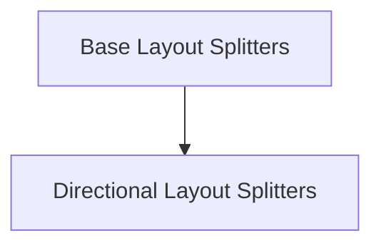

# Layout Splitting Module

The `layout_splitting` module provides core functionalities for dividing and organizing screen real estate within Rich layouts. It defines various splitter types that enable developers to create complex, responsive, and visually structured terminal UIs.

## Architecture Overview

This module is comprised of two main sub-modules:

- [Base Layout Splitters](base_splitters.md): Defines the foundational `Splitter` interface and a `NoSplitter` implementation.
- [Directional Layout Splitters](directional_splitters.md): Offers concrete implementations for splitting layouts horizontally (`RowSplitter`) and vertically (`ColumnSplitter`).

These splitters work in conjunction with the main `Layout` component (found in the [rich_layout.md](rich_layout.md) module) to define how available space is distributed among different renderables.

<!-- DIAGRAM_JSON
{
    "direction": "TD",
    "nodes": [
        {"id": "base_splitters", "label": "Base Layout Splitters", "type": "module", "link": "base_splitters.md"},
        {"id": "directional_splitters", "label": "Directional Layout Splitters", "type": "module", "link": "directional_splitters.md"}
    ],
    "edges": [
        {"source": "base_splitters", "target": "directional_splitters"}
    ],
    "groups": []
}
-->

