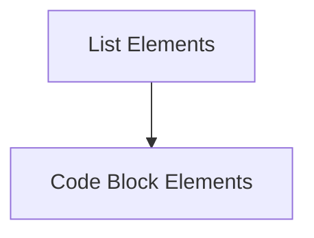

# `list_and_code_blocks` Module Documentation

## Introduction

The `list_and_code_blocks` module, part of `rich_markdown.markdown_elements`, is responsible for parsing and rendering list items, entire lists, and code blocks within Markdown documents. It provides the foundational components for displaying structured textual and code content beautifully using the Rich library.

## Architecture

The module is composed of two primary sub-modules:

*   **Code Block Elements**: Manages the display and formatting of code blocks.
*   **List Elements**: Handles the rendering and structure of list items and full lists.

These sub-modules work together to ensure that lists and code are correctly interpreted and rendered according to Markdown syntax.

<!-- DIAGRAM_JSON
{
    "direction": "TD",
    "nodes": [
        {"id": "list_elements", "label": "List Elements", "type": "module", "link": "list_elements.md"},
        {"id": "code_block_elements", "label": "Code Block Elements", "type": "module", "link": "code_block_elements.md"}
    ],
    "edges": [
        {"source": "list_elements", "target": "code_block_elements"}
    ],
    "groups": []
}
-->

## Sub-modules

### Code Block Elements

This sub-module focuses on the `CodeBlock` component, which is essential for rendering pre-formatted code snippets within Markdown. For more details, refer to [code_block_elements.md](code_block_elements.md).

### List Elements

This sub-module encompasses `ListItem` and `ListElement`, which are critical for handling both individual items and the overall structure of ordered and unordered lists in Markdown. For more details, refer to [list_elements.md](list_elements.md).