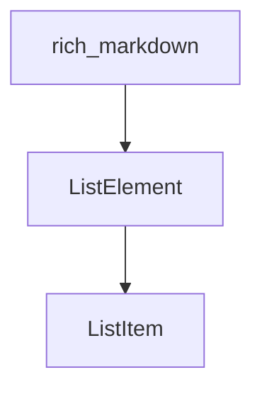

# `list_elements` Module Documentation

## Introduction

The `list_elements` module is a crucial component within the `rich_markdown` package, specifically designed to handle the representation of list structures in Markdown content. It defines the core data models for individual list items and complete lists, enabling Rich to parse, store, and render ordered and unordered lists effectively.

## Architecture and Component Relationships

This module defines two primary components: `ListItem` and `ListElement`. `ListElement` acts as a container for multiple `ListItem` instances, representing a complete list structure. These components are integral to how the `rich_markdown` module processes and displays list content.

<!-- DIAGRAM_JSON
{
    "direction": "TD",
    "nodes": [
        {"id": "list_item", "label": "ListItem", "type": "component", "link": null},
        {"id": "list_element", "label": "ListElement", "type": "component", "link": null},
        {"id": "rich_markdown", "label": "rich_markdown", "type": "external", "link": "rich_markdown.md"}
    ],
    "edges": [
        {"source": "list_element", "target": "list_item"},
        {"source": "rich_markdown", "target": "list_element"}
    ],
    "groups": []
}
-->

### `ListElement`

The `ListElement` class represents an entire list in Markdown. It encapsulates properties such as whether the list is ordered or unordered, and crucially, it holds a collection of `ListItem` objects that constitute the list's entries.

### `ListItem`

The `ListItem` class represents a single item within a list. It contains the content of that specific list item, which can include various other Markdown elements. It handles the indentation and bullet/numbering details for individual list entries.

## Integration with the Overall System

`list_elements` is a specialized sub-module of `rich_markdown`, focusing solely on the structural representation of lists. The `rich_markdown` module utilizes `ListElement` and `ListItem` instances generated during its parsing phase to construct a renderable tree of Markdown content. These list structures are then interpreted by the Rich console rendering pipeline to display lists correctly in the terminal. For more details on how lists are parsed and rendered within the larger Markdown context, refer to the [rich_markdown](rich_markdown.md) documentation.
