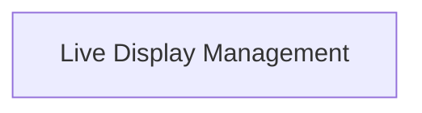

# Live Display Management

Handles the dynamic updating of rich content in the terminal, such as progress bars or animated displays.

## Components

This module contains 1 component(s):

- `rich_live.Live`

## Structure

---
*This documentation was auto-generated to ensure completeness.*
