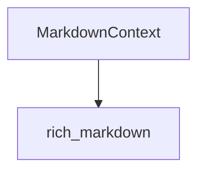

# Module: `markdown_context_management`

## Introduction

The `markdown_context_management` module is a specialized component within the `rich_markdown` system, focusing on managing the contextual information required during the parsing and rendering of Markdown content. Its primary contribution is the `MarkdownContext` object, which encapsulates various states and settings that influence how Markdown is processed and displayed.

## Core Functionality

The core functionality of this module revolves around the `rich_markdown.MarkdownContext` class. This class serves as a mutable container for contextual data that changes as a Markdown document is processed. It might track:

*   **Current heading levels:** To correctly render headings and potentially build a table of contents.
*   **Link management:** Storing information about resolved links or link definitions.
*   **Rendering options:** Flags or settings that modify the output based on the current context.

By centralizing this contextual information, `MarkdownContext` facilitates a more robust and adaptable Markdown parsing and rendering process.

## Architecture and Component Relationships

The `markdown_context_management` module is a leaf module within the `rich_markdown` hierarchy, specifically nested under `markdown_parsing_and_context`. It exposes the `MarkdownContext` class, which is sourced from the `rich_markdown` module itself.

The `MarkdownContext` object is designed to be instantiated and passed through the various stages of Markdown processing. It maintains a state that can be read and updated by different components involved in parsing and rendering, ensuring a consistent application of rules and styles.

<!-- DIAGRAM_JSON
{
    "direction": "TD",
    "nodes": [
        {"id": "markdown_context", "label": "MarkdownContext", "type": "component", "link": null},
        {"id": "rich_markdown", "label": "rich_markdown", "type": "external", "link": "rich_markdown.md"}
    ],
    "edges": [
        {"source": "markdown_context", "target": "rich_markdown"}
    ],
    "groups": []
}
-->

## How it Fits into the Overall System

The `markdown_context_management` module, through its `MarkdownContext` component, is integral to the dynamic nature of Markdown rendering in Rich. When a `rich_markdown.Markdown` object (documented in [rich_markdown.md](rich_markdown.md)) is processed, an instance of `MarkdownContext` is typically created. This context object is then passed to various renderers and parsers, allowing them to access and modify shared state information.

For example, as the parser encounters different Markdown elements like headings or links, it updates the `MarkdownContext`. This ensures that subsequent elements or rendering passes have access to the most current contextual data. This mechanism promotes modularity and flexibility, enabling complex rendering behaviors without tightly coupling individual rendering components. It effectively acts as an environmental variable store for the Markdown rendering pipeline.