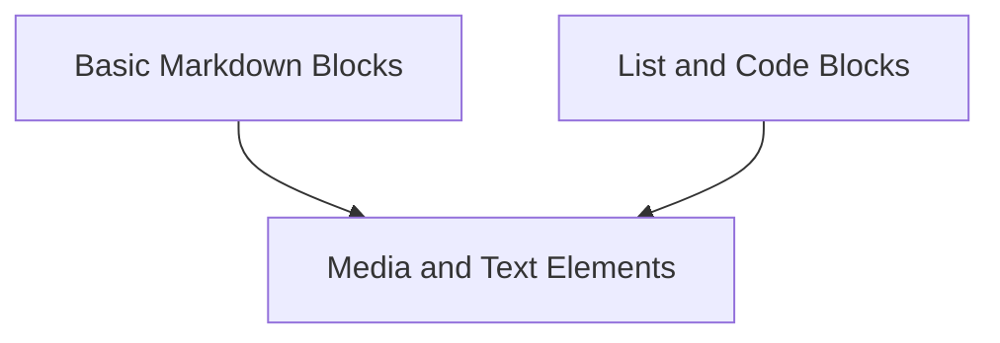

# markdown_elements Module Documentation

## Introduction and Purpose

The `markdown_elements` module is a core component within the `rich_markdown` package, responsible for defining and managing the various structural and content elements that constitute a Markdown document. It provides the building blocks for parsing, representing, and rendering Markdown into rich text.

## Architecture Overview

This module is logically divided into several sub-modules, each handling a specific category of Markdown elements. The architecture is designed to provide a clear separation of concerns, making the parsing and rendering process modular and extensible.

<!-- DIAGRAM_JSON
{
    "direction": "TD",
    "nodes": [
        {"id": "basic_markdown_blocks", "label": "Basic Markdown Blocks", "type": "module", "link": "basic_markdown_blocks.md"},
        {"id": "list_and_code_blocks", "label": "List and Code Blocks", "type": "module", "link": "list_and_code_blocks.md"},
        {"id": "media_and_text_elements", "label": "Media and Text Elements", "type": "module", "link": "media_and_text_elements.md"}
    ],
    "edges": [
        {"source": "basic_markdown_blocks", "target": "media_and_text_elements"},
        {"source": "list_and_code_blocks", "target": "media_and_text_elements"}
    ],
    "groups": []
}
-->

## Sub-module Functionality

### [Basic Markdown Blocks](basic_markdown_blocks.md)
This sub-module defines and manages the fundamental structural elements of Markdown, such as headings, paragraphs, links, block quotes, and horizontal rules. It provides the core components for outlining the document structure.

### [List and Code Blocks](list_and_code_blocks.md)
Responsible for handling Markdown list elements (both ordered and unordered) and code blocks. This includes the parsing and representation of individual list items and multi-line code segments.

### [Media and Text Elements](media_and_text_elements.md)
This sub-module focuses on content-related elements like images and general text. It provides the definitions for embedding images and managing raw text content within a Markdown document.