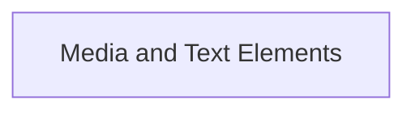

# Media and Text Elements Module

## Introduction

The `media_and_text_elements` module, a sub-component of `rich_markdown`, defines the fundamental building blocks for representing various media and text elements within parsed Markdown content. It provides classes for handling images and generic text, which are crucial for rendering rich Markdown output.

## Architecture Overview

This module primarily focuses on the atomic representation of media and text. It encapsulates the data structures for these elements, allowing the `rich_markdown` module to process and render them effectively. The main components are designed to be simple and directly representational.

<!-- DIAGRAM_JSON
{
    "direction": "TD",
    "nodes": [
        {"id": "media_elements", "label": "Media and Text Elements", "type": "module", "link": "media_elements.md"}
    ],
    "edges": [],
    "groups": []
}
-->

## Sub-modules

### [Media and Text Elements](media_elements.md)
This sub-module (`media_elements`) encapsulates the core components `ImageItem` and `TextElement`, providing the foundational data structures for handling images and textual content parsed from Markdown. It serves as a direct representation layer for these common Markdown elements.