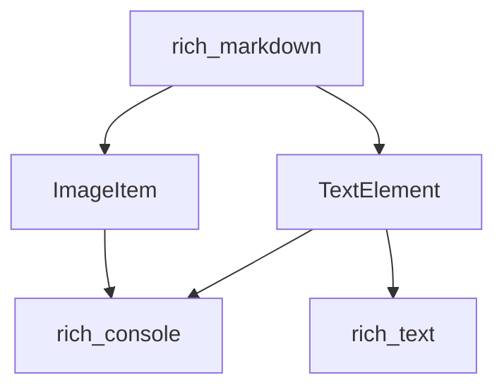

# media_elements Module Documentation

## Introduction
The `media_elements` module, a sub-component of `rich_markdown.markdown_elements.media_and_text_elements`, is responsible for representing and handling media-related elements within Markdown documents. Specifically, it provides structures for `ImageItem` and `TextElement`, facilitating their integration and rendering within the rich text display system.

## Purpose and Core Functionality
The primary purpose of the `media_elements` module is to encapsulate the data and behavior associated with images and basic text blocks encountered during Markdown parsing. It ensures that these fundamental content types can be consistently processed and prepared for rendering by the Rich library.

Its core functionalities include:
*   **`ImageItem`**: Represents an image within a Markdown document, typically storing its source (URL or path), alternative text, and potentially a title.
*   **`TextElement`**: Represents a block of plain text within a Markdown document, holding the textual content itself.

## Architecture and Component Relationships

The `media_elements` module defines two core components:

### `ImageItem`
The `ImageItem` class serves as a data structure for images found in Markdown. It captures all necessary information to display an image, such as its source and descriptive text. When a Markdown document is parsed, image syntax is transformed into `ImageItem` instances.

### `TextElement`
The `TextElement` class represents a segment of text. In the context of Markdown, this could be any regular text content that is not part of a more specialized Markdown element (like a heading, list item, or code block). It primarily holds the string content.

### Relationships
Both `ImageItem` and `TextElement` are fundamental building blocks that the `rich_markdown` module utilizes to construct the visual representation of a Markdown document. They are designed to be consumed by the `rich_console` module for actual rendering, with `TextElement` specifically leveraging the capabilities of `rich_text` for rich text formatting and styling.

## System Integration
The `media_elements` module is an integral part of the `rich_markdown` system. It sits within the hierarchy of Markdown element definitions, providing concrete implementations for media and basic text. When `rich_markdown` parses a Markdown input, it uses these elements to represent images and text content. The higher-level `rich_markdown` module then orchestrates the rendering of these elements through the `rich_console` interface.

<!-- DIAGRAM_JSON
{
    "direction": "TD",
    "nodes": [
        {"id": "image_item", "label": "ImageItem", "type": "component", "link": null},
        {"id": "text_element", "label": "TextElement", "type": "component", "link": null},
        {"id": "rich_markdown", "label": "rich_markdown", "type": "external", "link": "rich_markdown.md"},
        {"id": "rich_console", "label": "rich_console", "type": "external", "link": "rich_console.md"},
        {"id": "rich_text", "label": "rich_text", "type": "external", "link": "rich_text.md"}
    ],
    "edges": [
        {"source": "image_item", "target": "rich_console"},
        {"source": "text_element", "target": "rich_console"},
        {"source": "text_element", "target": "rich_text"},
        {"source": "rich_markdown", "target": "image_item"},
        {"source": "rich_markdown", "target": "text_element"}
    ],
    "groups": []
}
-->

