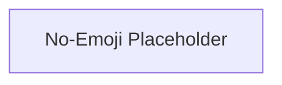

# No-Emoji Placeholder

Provides a mechanism for handling scenarios where emoji display is suppressed or not desired, offering a graceful fallback.

## Components

This module contains 1 component(s):

- `NoEmoji`

## Structure

---
*This documentation was auto-generated to ensure completeness.*
