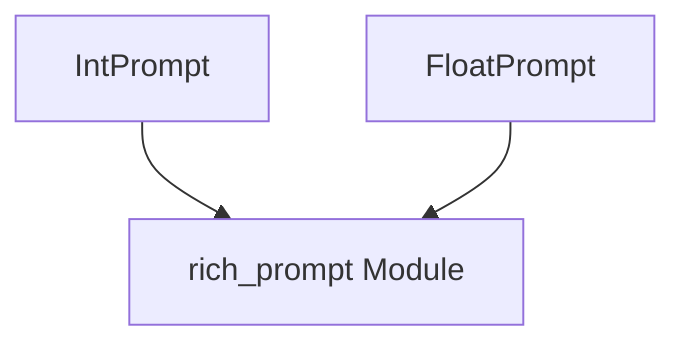

# numerical_input_handling Module Documentation

The `numerical_input_handling` module provides specialized prompt classes for gathering validated numerical input (integers and floating-point numbers) from users. It builds upon the foundational `rich.prompt` module to offer a robust and user-friendly experience for numerical data entry in command-line interfaces.

## Core Functionality

This module encapsulates the logic for displaying prompts, handling user input, and performing type conversion and basic validation for integer and float values. It ensures that the input received conforms to the expected numerical type, simplifying the development of interactive command-line applications.

### `IntPrompt`

The `IntPrompt` class is designed to solicit integer input from the user. It extends the base prompting capabilities provided by the `rich_prompt` module to specifically handle and validate integer values. If the user provides non-integer input, the prompt can be configured to re-prompt until valid input is received.

### `FloatPrompt`

Similarly, the `FloatPrompt` class manages prompts for floating-point numbers. It leverages the underlying `rich_prompt` infrastructure to parse and validate float inputs, allowing applications to easily collect decimal numbers from users. Like `IntPrompt`, it can enforce valid float input through re-prompting.

## Architecture and Component Relationships

The `numerical_input_handling` module directly utilizes and extends components from the [rich_prompt](rich_prompt.md) module. Specifically, both `IntPrompt` and `FloatPrompt` are derived from the `PromptBase` class (or `Prompt` class, which itself inherits from `PromptBase`) within `rich_prompt`. This inheritance provides them with the core functionality for displaying prompts, handling default values, and managing basic input/output interactions.

This module acts as a concrete implementation layer for numerical input within the broader `rich` ecosystem, offering ready-to-use classes for common numerical prompting scenarios without requiring developers to re-implement input validation and type conversion.

## Integration with the Overall System

The `numerical_input_handling` module is an integral part of the `rich` library's interactive input capabilities. It allows developers to easily incorporate robust numerical input mechanisms into their `rich`-powered command-line applications. By abstracting the complexities of input validation and error handling, it contributes to creating more reliable and user-friendly interfaces.

It sits within the `rich.prompt` hierarchy, making it a natural extension for any application already using `rich` for prompting. For example, a CLI tool might use `IntPrompt` to ask for a quantity or an ID, and `FloatPrompt` for a measurement or a price.

<!-- DIAGRAM_JSON
{
    "direction": "TD",
    "nodes": [
        {"id": "int_prompt", "label": "IntPrompt", "type": "component", "link": null},
        {"id": "float_prompt", "label": "FloatPrompt", "type": "component", "link": null},
        {"id": "rich_prompt", "label": "rich_prompt Module", "type": "external", "link": "rich_prompt.md"}
    ],
    "edges": [
        {"source": "int_prompt", "target": "rich_prompt"},
        {"source": "float_prompt", "target": "rich_prompt"}
    ],
    "groups": []
}
-->

