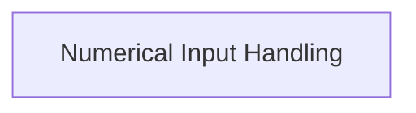

# Numerical Prompts Module

## Introduction

The `numerical_prompts` module provides functionalities for handling user input specifically for numerical values, extending the capabilities of the `rich_prompt` module. It includes components for validating and processing integer and float inputs, ensuring robust and user-friendly interactive prompts.

## Architecture

This module is a sub-module of `rich_prompt.specific_prompts` and focuses on the core logic for numerical input. It is composed of a single sub-module that encapsulates the handling of different numerical types.

<!-- DIAGRAM_JSON
{
    "direction": "TD",
    "nodes": [
        {"id": "numerical_input_handling", "label": "Numerical Input Handling", "type": "module", "link": "numerical_input_handling.md"}
    ],
    "edges": [],
    "groups": []
}
-->

## Sub-modules

### [Numerical Input Handling](numerical_input_handling.md)

This sub-module, containing `IntPrompt` and `FloatPrompt`, is responsible for managing the processing and validation of integer and float inputs from users. It provides the core logic for creating interactive prompts that accept and validate numerical data.