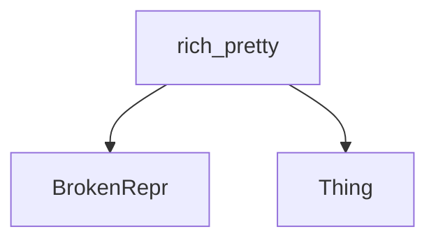

# `object_representation_elements` Module Documentation

## Introduction

The `object_representation_elements` module, part of the `rich_pretty` package, provides fundamental elements for representing objects, particularly in scenarios where a complete or specific representation might be unavailable or generic. It defines core data structures that facilitate the pretty-printing of objects, even when their `__repr__` method might be broken or when a generic representation is sufficient.

## Core Functionality

This module defines two key components:

*   **`BrokenRepr`**: Represents an object whose `__repr__` method has failed or produced an unparseable output. It serves as a placeholder or indicator when the standard representation mechanism encounters an error, ensuring that the pretty-printer can still render *something* rather than crashing.
*   **`Thing`**: A generic representation for an object. It provides a basic, catch-all way to represent objects when more specific formatting is not available or necessary. This is useful for types that don't have a custom `__pretty__` method or `__repr__` that `rich` can interpret more deeply.

These components are crucial for the robustness of the `rich_pretty` module, allowing it to handle a wide variety of object types gracefully.

## Architecture and Component Relationships

The `object_representation_elements` module serves as a foundational layer within the `rich_pretty` package, specifically within the `pretty_representation` sub-module. It provides the basic building blocks (`BrokenRepr` and `Thing`) that the pretty-printing logic in `rich_pretty` uses to construct a visual representation of Python objects. These elements are consumed by higher-level components within `rich_pretty` to render complex data structures and objects into a human-readable format.

For a broader understanding of the pretty-printing architecture, refer to the [rich_pretty documentation](rich_pretty.md).

<!-- DIAGRAM_JSON
{
    "direction": "TD",
    "nodes": [
        {"id": "broken_repr", "label": "BrokenRepr", "type": "component", "link": null},
        {"id": "thing", "label": "Thing", "type": "component", "link": null},
        {"id": "rich_pretty", "label": "rich_pretty", "type": "external", "link": "rich_pretty.md"}
    ],
    "edges": [
        {"source": "rich_pretty", "target": "broken_repr"},
        {"source": "rich_pretty", "target": "thing"}
    ],
    "groups": []
}
-->

