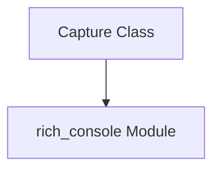

# `output_capture` Module Documentation

## Introduction

The `output_capture` module, a sub-module within the `rich_console` ecosystem, provides the `Capture` class, a utility for capturing console output. This module is essential for scenarios where programmatic control over what is rendered to the console is required, allowing developers to inspect or redirect output without it being directly displayed.

## Core Functionality

The primary function of the `output_capture` module is facilitated by the `rich_console.Capture` class. This class acts as a context manager that temporarily redirects standard output (`sys.stdout`) to an in-memory buffer. Any content written to the console within the `Capture` context will be stored and can later be retrieved as a string.

This functionality is particularly useful for:
*   **Testing**: Capturing and asserting against the output of console-based applications.
*   **Redirection**: Temporarily redirecting output to a file or another stream.
*   **Preprocessing**: Modifying or analyzing console output before it's displayed.

## Architecture and Component Relationships

The `output_capture` module is a leaf module within the `rich_console`'s `renderable_elements` sub-module. It encapsulates the `Capture` component, which directly interacts with the core `rich_console` functionalities to manage output redirection.

Its integration within `rich_console.core_console_components.renderable_elements` signifies its role as a specific type of renderable element that, instead of displaying content, captures it. This allows `Capture` to seamlessly integrate with other `rich` components that produce console output.

<!-- DIAGRAM_JSON
{
    "direction": "TD",
    "nodes": [
        {"id": "capture_class", "label": "Capture Class", "type": "component", "link": null},
        {"id": "rich_console", "label": "rich_console Module", "type": "external", "link": "rich_console.md"}
    ],
    "edges": [
        {"source": "capture_class", "target": "rich_console"}
    ],
    "groups": []
}
-->

