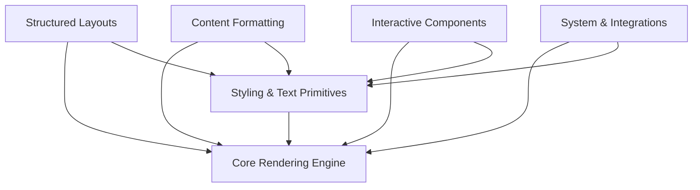

The Rich repository contains the source code for the Rich library, a powerful Python library designed to bring beautiful and highly functional rich text and formatting to the terminal. Its purpose is to enable developers to create visually appealing, interactive, and informative command-line applications by providing a comprehensive set of tools for advanced styling, complex layout management, dynamic content displays, and enhanced content formatting.

### Architecture Overview

The Rich library's architecture is modular, built around a central rendering engine that interacts with various specialized components for styling, layout, content processing, and interactive features. The following diagram illustrates the high-level relationships between the main conceptual groups of modules:

### Module Groups Overview

*   **Core Rendering Engine**: This group centers around the [rich_console](rich_console.md) module, which is the heart of the Rich library. It orchestrates how all other renderable objects are displayed to the terminal, handling terminal capabilities, dimensions, and output streams.

*   **Styling & Text Primitives**: These modules provide the foundational elements for visual presentation. Key modules include [rich_style](rich_style.md) (for managing text attributes), [rich_color](rich_color.md) (for color definitions), [rich_text](rich_text.md) (for styled text objects), [rich_segment](rich_segment.md) (for low-level output units), and [rich_measure](rich_measure.md) (for calculating renderable dimensions).

*   **Structured Layouts**: This group focuses on arranging content in organized ways. It includes modules like [rich_layout](rich_layout.md) (for advanced layout management), [rich_panel](rich_panel.md) (for bordered content), [rich_table](rich_table.md) (for tabular data), [rich_columns](rich_columns.md) (for multi-column displays), [rich_rule](rich_rule.md) (for horizontal separators), [rich_padding](rich_padding.md) (for spacing), and [rich_align](rich_align.md) (for content alignment).

*   **Content Formatting**: Modules in this category enhance the presentation of specific content types. Examples include [rich_syntax](rich_syntax.md) (for syntax highlighting code), [rich_pretty](rich_pretty.md) (for pretty-printing Python objects), [rich_traceback](rich_traceback.md) (for beautiful exception tracebacks), [rich_json](rich_json.md) (for JSON highlighting), [rich_markup](rich_markup.md) (for Rich's inline markup), and [rich_emoji](rich_emoji.md) (for emoji handling).

*   **Interactive Components**: These modules enable dynamic and user-interactive elements in the terminal. This group features [rich_live](rich_live.md) (for live-updating displays), [rich_progress](rich_progress.md) (for animated progress bars), [rich_prompt](rich_prompt.md) (for interactive user input), [rich_spinner](rich_spinner.md) (for loading indicators), and [rich_pager](rich_pager.md) (for paginating large outputs).

*   **System & Integrations**: This category covers modules that provide utilities, platform-specific features, or integrations with external systems. Notable modules include [rich_logging](rich_logging.md) (for enhanced logging), [rich_inspect](rich_inspect.md) (for object introspection), [rich_jupyter](rich_jupyter.md) (for Jupyter notebook integration), [rich_windows](rich_windows.md) (for Windows console compatibility), [rich_file_proxy](rich_file_proxy.md) (for output redirection), [rich_abc](rich_abc.md) (for abstract base classes), and [rich_repr](rich_repr.md) (for rich object representations).