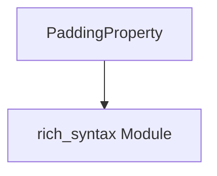

# `padding_utilities` Module Documentation

## Introduction

The `padding_utilities` module, a sub-module of `rich_syntax`, provides utilities specifically for managing padding properties within Rich's syntax highlighting features. Its primary role is to define the structure for specifying padding around code blocks or other rendered elements.

## Core Functionality

The `padding_utilities` module exposes the `PaddingProperty` component, which is central to defining and applying padding in syntax-highlighted code.

### `PaddingProperty`

The `rich_syntax.PaddingProperty` class is a data structure used to encapsulate the four possible padding values: top, right, bottom, and left. This allows for precise control over the spacing around rendered content, particularly within syntax highlighting contexts. It ensures that padding specifications are consistently handled and applied throughout the `rich_syntax` module.

## Architecture and Component Relationships

The `padding_utilities` module is a focused component within the larger `rich_syntax` module, primarily serving to define a data structure for padding. It directly contributes to how syntax highlighting elements are laid out.

<!-- DIAGRAM_JSON
{
    "direction": "TD",
    "nodes": [
        {"id": "padding_property", "label": "PaddingProperty", "type": "component", "link": null},
        {"id": "rich_syntax", "label": "rich_syntax Module", "type": "external", "link": "rich_syntax.md"}
    ],
    "edges": [
        {"source": "padding_property", "target": "rich_syntax"}
    ],
    "groups": []
}
-->

## How the Module Fits into the Overall System

`padding_utilities` is an integral part of the [rich_syntax](rich_syntax.md) module. It provides the foundational `PaddingProperty` data structure that other components within `rich_syntax` (like `Syntax` itself) utilize to control the visual spacing and layout of highlighted code blocks. By centralizing the definition of padding properties, this module ensures consistency and simplifies the management of spacing requirements across Rich's syntax rendering capabilities. It doesn't directly interact with other top-level modules but rather serves the specific needs of its parent module, `rich_syntax`.