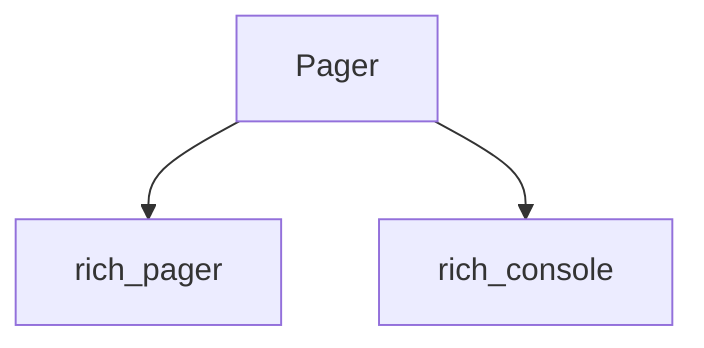

# pager_component

The `pager_component` module provides the core `Pager` component, which is responsible for managing paginated output within the Rich library. This module facilitates displaying large amounts of text in a user-friendly, scrollable manner, typically leveraging system pagers when available.

## Architecture and Component Relationships

This module's primary component is `Pager`, which works in conjunction with the broader `rich_pager` module to handle output pagination. The `Pager` component abstracts the details of interacting with either an internal Rich pager implementation or an external system pager.

<!-- DIAGRAM_JSON
{
    "direction": "TD",
    "nodes": [
        {"id": "pager", "label": "Pager", "type": "component", "link": null},
        {"id": "rich_pager", "label": "rich_pager", "type": "external", "link": "rich_pager.md"},
        {"id": "rich_console", "label": "rich_console", "type": "external", "link": "rich_console.md"}
    ],
    "edges": [
        {"source": "pager", "target": "rich_pager"},
        {"source": "pager", "target": "rich_console"}
    ],
    "groups": []
}
-->

### Pager

The `Pager` component is an abstraction for displaying content that exceeds the terminal's screen height. It provides methods to write content to a pager, ensuring that the user can scroll through the output. It is designed to integrate seamlessly with the Rich `Console` for rendering.

## Integration with the System

The `pager_component` module, through its `Pager` component, is a crucial part of the Rich library's ability to handle large outputs gracefully. It is typically used by the `rich_console` module when the output of a rendering operation is too extensive to fit on a single screen. This allows Rich applications to provide a better user experience by preventing output from simply scrolling off-screen without user interaction. It also works in close relation with the `system_pager_component`, which specifically deals with the interaction with external system pagers like `less` or `more`.
