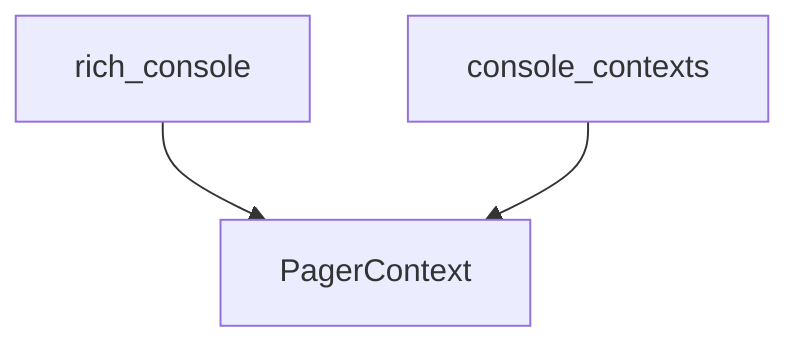

# pager_context Module Documentation

The `pager_context` module is a focused component within the Rich library's console management system, specifically designed to handle terminal pagination. It provides the `PagerContext` class, a context manager that enables Rich applications to display extensive output in a paginated manner, significantly enhancing the user experience for content that would otherwise scroll off-screen rapidly.

## Purpose and Core Functionality

The primary purpose of `PagerContext` is to integrate with external terminal pagers (such as `less` or `more`) to control the flow of output. When activated, it redirects the console's output through the designated pager, allowing users to navigate through the content page by page. This is particularly useful for displaying long logs, detailed reports, or large data structures without overwhelming the terminal buffer.

## Architecture and Component Relationships

The `PagerContext` class is defined within the `rich_console` module and is exposed as a core component of the `pager_context` module. It is part of a broader set of console-related context managers grouped under the `console_contexts` sub-module, which also includes `screen_context` and `theme_context`. This architectural choice allows for modular management of various console behaviors, ensuring that pagination logic is encapsulated and distinct from other rendering concerns. `PagerContext` interacts directly with the underlying `rich_console` instance to intercept and manage output streams, effectively bridging Rich's rendering capabilities with external pagination tools.

## How it Fits into the Overall System

`PagerContext` plays a crucial role in the Rich library's strategy for managing user interaction with large outputs. By providing a standardized way to invoke and control terminal pagers, it ensures that Rich applications can gracefully handle diverse content lengths. It integrates seamlessly into the `rich_console`'s rendering pipeline, offering a flexible mechanism to opt into paginated display when needed. This contributes to Rich's overall goal of providing highly readable and user-friendly terminal interfaces for complex applications.

<!-- DIAGRAM_JSON
{
    "direction": "TD",
    "nodes": [
        {"id": "PagerContext", "label": "PagerContext", "type": "component", "link": null},
        {"id": "rich_console", "label": "rich_console", "type": "external", "link": "rich_console.md"},
        {"id": "console_contexts", "label": "console_contexts", "type": "external", "link": "console_contexts.md"}
    ],
    "edges": [
        {"source": "rich_console", "target": "PagerContext"},
        {"source": "console_contexts", "target": "PagerContext"}
    ],
    "groups": []
}
-->

