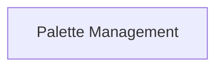

# Palette Management

Manages collections of colors and provides methods for accessing and manipulating them.

## Components

This module contains 1 component(s):

- `rich_palette.Palette`

## Structure

---
*This documentation was auto-generated to ensure completeness.*
