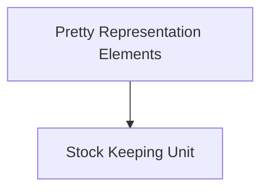

# pretty_data_structures Module Documentation

## Introduction
The `pretty_data_structures` module, a sub-component of `rich_pretty`, is responsible for defining the fundamental data structures used internally by Rich's pretty-printing capabilities. It provides the building blocks for representing complex Python objects in a human-readable and visually appealing format, particularly when dealing with recursive or deeply nested data.

## Architecture Overview
This module is structured into key components that facilitate the creation and manipulation of these internal pretty-printing data representations. It interacts closely with the broader `rich_pretty` module to render these structures effectively.

<!-- DIAGRAM_JSON
{
    "direction": "TD",
    "nodes": [
        {"id": "pretty_representation_elements", "label": "Pretty Representation Elements", "type": "module", "link": "pretty_representation_elements.md"},
        {"id": "pretty_sku", "label": "Stock Keeping Unit", "type": "module", "link": "pretty_sku.md"}
    ],
    "edges": [
        {"source": "pretty_representation_elements", "target": "pretty_sku"}
    ],
    "groups": []
}
-->

## Sub-modules

### Pretty Representation Elements (`pretty_representation_elements.md`)
This sub-module defines core structural elements like `_Line` and `Node` that are essential for building the internal tree-like representation of data when pretty-printing. These components form the backbone upon which complex data structures are organized for display.

### Stock Keeping Unit (`pretty_sku.md`)
This sub-module introduces `StockKeepingUnit`, a specific data structure used within the pretty-printing process. It typically helps in tracking and managing individual units or objects as they are processed and formatted, ensuring consistent and accurate representation.
