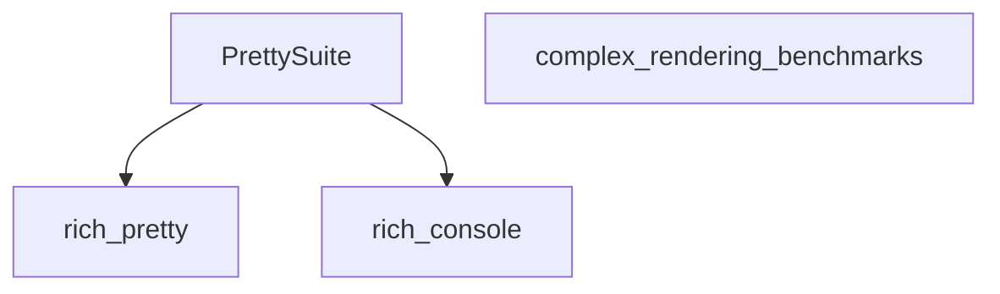

The `pretty_rendering_benchmarks` module is dedicated to benchmarking the performance of Rich's pretty rendering capabilities. As a leaf module within the `benchmarks` suite, it focuses specifically on the `PrettySuite` component, providing insights into the efficiency of rendering complex data structures in a human-readable format.

### Purpose and Core Functionality

The primary purpose of `pretty_rendering_benchmarks` is to measure and evaluate the speed and resource consumption of `rich` when pretty-printing various Python objects. This module helps identify performance bottlenecks and ensures that the pretty-printing features remain performant, even with intricate data.

The core component, `PrettySuite`, encapsulates the benchmark tests related to pretty rendering. It leverages the `rich.pretty` module for the actual pretty-printing logic and `rich.console` for rendering the output, making it a critical part of assessing Rich's rendering efficiency.

### Architecture and Component Relationships

The `pretty_rendering_benchmarks` module is a specialized submodule of `complex_rendering_benchmarks`, which itself is part of the broader `benchmarks` suite. This hierarchical structure allows for focused benchmarking efforts while maintaining an organized test suite.

The `PrettySuite` component directly interacts with the core `rich.pretty` module to perform its benchmarks. It also relies on `rich.console` for output rendering and console interaction, typical for any Rich component that displays content.

<!-- DIAGRAM_JSON
{
    "direction": "TD",
    "nodes": [
        {"id": "pretty_suite", "label": "PrettySuite", "type": "component", "link": null},
        {"id": "rich_pretty", "label": "rich_pretty", "type": "external", "link": "rich_pretty.md"},
        {"id": "rich_console", "label": "rich_console", "type": "external", "link": "rich_console.md"},
        {"id": "complex_rendering_benchmarks", "label": "complex_rendering_benchmarks", "type": "external", "link": "complex_rendering_benchmarks.md"}
    ],
    "edges": [
        {"source": "pretty_suite", "target": "rich_pretty"},
        {"source": "pretty_suite", "target": "rich_console"}
    ],
    "groups": []
}
-->

### How the Module Fits into the Overall System

`pretty_rendering_benchmarks` plays a crucial role within the `benchmarks` system by ensuring the quality and performance of Rich's pretty-printing functionality. It provides a dedicated testing ground for this specific rendering aspect, allowing developers to track performance changes and regressions related to pretty rendering independently.

It is part of the `complex_rendering_benchmarks` group, alongside `syntax_wrapping_benchmarks` and `table_rendering_benchmarks`, indicating its focus on more intricate rendering scenarios compared to `basic_rendering_benchmarks`. This modular approach helps maintain a clear separation of concerns within the benchmarking suite.

By providing consistent and reliable performance metrics for pretty rendering, this module contributes to the overall stability and efficiency of the `rich` library.
