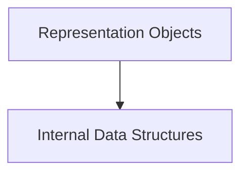

# pretty_representation Module Documentation

## Introduction and Purpose
The `pretty_representation` module in Rich is responsible for handling the internal data structures and objects that facilitate the "pretty printing" of Python objects. It defines how objects are broken down into representable units, managed, and displayed in a readable, formatted manner, especially within the context of Rich's `Pretty` and `RichFormatter` classes (documented in [pretty_formatting.md](pretty_formatting.md)).

## Architecture Overview
The `pretty_representation` module is composed of two main sub-modules: `pretty_data_structures` and `representation_objects`. These sub-modules work together to define the building blocks and higher-level constructs for representing objects in a "pretty" format.

<!-- DIAGRAM_JSON
{
    "direction": "TD",
    "nodes": [
        {"id": "pretty_data_structures", "label": "Internal Data Structures", "type": "module", "link": "pretty_data_structures.md"},
        {"id": "representation_objects", "label": "Representation Objects", "type": "module", "link": "representation_objects.md"}
    ],
    "edges": [
        {"source": "representation_objects", "target": "pretty_data_structures"}
    ],
    "groups": []
}
-->

## High-Level Functionality

### [Internal Data Structures](pretty_data_structures.md)
This sub-module defines the fundamental building blocks used internally by Rich to structure and manage information about objects during the pretty printing process. It includes components like `_Line` for handling output lines, `Node` for representing hierarchical structures, and `StockKeepingUnit` for managing representable units.

### [Representation Objects](representation_objects.md)
This sub-module provides the core objects that encapsulate and manage various forms of object representations. It includes `Thing` for generic object representation and `BrokenRepr` for handling objects that cannot be successfully represented, providing robust error handling for pretty printing.
