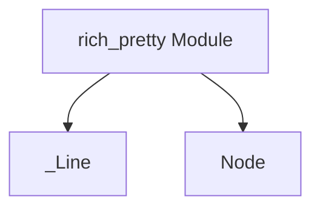

# Module: `pretty_representation_elements`

## Introduction

The `pretty_representation_elements` module provides fundamental data structures, `_Line` and `Node`, that are essential building blocks for the pretty-printing functionality within the `rich_pretty` module. These components are designed to represent individual lines and nodes in the abstract syntax tree or hierarchical structure generated during the pretty-printing process, enabling Rich to format complex data structures into human-readable output.

## Purpose and Core Functionality

This module defines the basic representational elements used by the pretty-printer:

*   **`_Line`**: Represents a single line of output within the pretty-printed structure. It typically contains segments of text and associated styles.
*   **`Node`**: Represents a structural component in the object graph or abstract representation that the pretty-printer is building. A `Node` can contain other `Node` instances or `_Line` instances, forming a tree-like structure that guides how complex objects are rendered.

These components are not directly exposed for public use but are integral to the internal workings of the pretty-printing system.

## Architecture and Component Relationships

`pretty_representation_elements` is a leaf module within the `rich_pretty` ecosystem, providing the atomic elements that higher-level components like `pretty_data_structures` and ultimately `rich_pretty` itself utilize to construct the visual representation of objects. The `_Line` and `Node` components are foundational for building the intermediate data structures that the `rich_pretty.Pretty` class processes to generate its formatted output.

For a broader understanding of the pretty-printing system, refer to the [rich_pretty module documentation](rich_pretty.md).

<!-- DIAGRAM_JSON
{
    "direction": "TD",
    "nodes": [
        {"id": "_line", "label": "_Line", "type": "component", "link": null},
        {"id": "node", "label": "Node", "type": "component", "link": null},
        {"id": "rich_pretty", "label": "rich_pretty Module", "type": "external", "link": "rich_pretty.md"}
    ],
    "edges": [
        {"source": "rich_pretty", "target": "_line"},
        {"source": "rich_pretty", "target": "node"}
    ],
    "groups": []
}
-->

