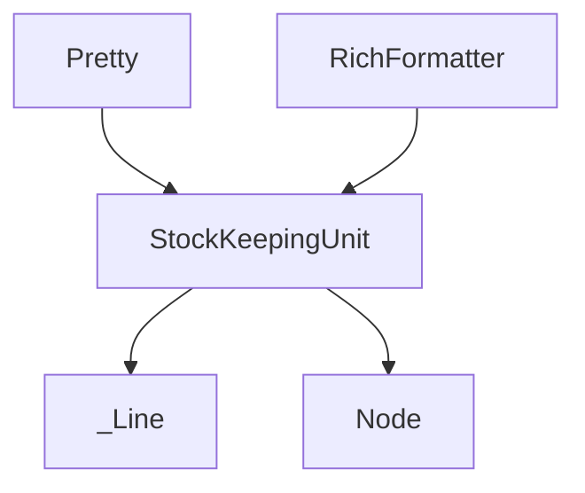

# pretty_sku Module Documentation

## Introduction
The `pretty_sku` module is a fundamental component within the `rich_pretty` package, specifically designed to manage `StockKeepingUnit` objects. These objects represent the smallest, indivisible units of content used during the pretty-printing process, ensuring a consistent and structured approach to rendering complex data structures. This module is critical for breaking down intricate Python objects into manageable parts that can then be formatted and displayed effectively.

## Purpose and Core Functionality
The primary purpose of the `pretty_sku` module is to define and manage the `StockKeepingUnit` class. A `StockKeepingUnit` (SKU) encapsulates a single, atomic piece of information, such as a string, an opening bracket, a closing bracket, or a separator, along with its associated style and formatting metadata. By representing content at this granular level, the `pretty_sku` module enables the `rich_pretty` system to precisely control the layout and appearance of pretty-printed output.

Core functionality includes:
- **`StockKeepingUnit` Definition**: Provides the blueprint for creating SKUs, holding content, length, and style information.
- **Content Abstraction**: Allows various types of content to be treated uniformly as units for formatting.
- **Integration with Pretty-Printing Logic**: Serves as a crucial building block that higher-level formatting components, like `Pretty` and `RichFormatter`, consume to construct the final visual representation of data.

## Architecture and Component Relationships

The `pretty_sku` module, through its `StockKeepingUnit` component, acts as a foundational data structure for representing segments of pretty-printed output. It is part of a larger ecosystem of data structures (`_Line`, `Node`) that collectively describe the structure of an object to be pretty-printed. These SKUs are then processed by formatting utilities such as `Pretty` and `RichFormatter` to produce human-readable output.

<!-- DIAGRAM_JSON
{
    "direction": "TD",
    "nodes": [
        {"id": "stock_keeping_unit", "label": "StockKeepingUnit", "type": "component", "link": null},
        {"id": "line_obj", "label": "_Line", "type": "external", "link": "pretty_representation_elements.md"},
        {"id": "node_obj", "label": "Node", "type": "external", "link": "pretty_representation_elements.md"},
        {"id": "pretty_formatter", "label": "Pretty", "type": "external", "link": "pretty_formatters.md"},
        {"id": "rich_formatter", "label": "RichFormatter", "type": "external", "link": "pretty_formatters.md"}
    ],
    "edges": [
        {"source": "pretty_formatter", "target": "stock_keeping_unit"},
        {"source": "rich_formatter", "target": "stock_keeping_unit"},
        {"source": "stock_keeping_unit", "target": "line_obj"},
        {"source": "stock_keeping_unit", "target": "node_obj"}
    ],
    "groups": []
}
-->

### Component Breakdown:

-   **`StockKeepingUnit`**: The sole core component of this module. It represents an atomic unit of content, containing its text, calculated length, and associated `rich.style.Style` information. These units are generated during the parsing of an object's representation and are subsequently arranged to form lines and nodes in the pretty-printed output.

## How the Module Fits into the Overall System
The `pretty_sku` module, via its `StockKeepingUnit`, is a crucial low-level building block in the `rich_pretty` system for generating elegant and readable representations of Python objects. It serves as the bridge between the raw data to be displayed and the advanced formatting capabilities of Rich.

It is utilized by:
-   **`pretty_representation_elements`**: Modules like `_Line` and `Node` from `pretty_representation_elements.md` would aggregate `StockKeepingUnit` objects to construct larger representational structures, defining how different parts of an object are grouped and displayed.
-   **`pretty_formatters`**: High-level formatters such as `Pretty` and `RichFormatter` from `pretty_formatters.md` consume streams of `StockKeepingUnit` objects to apply layout rules, line wrapping, and styling, ultimately rendering the final output to the console or other display targets.

In essence, `pretty_sku` ensures that all pieces of the pretty-printed output are uniformly defined and manageable, enabling a modular and extensible approach to complex object serialization and display.
