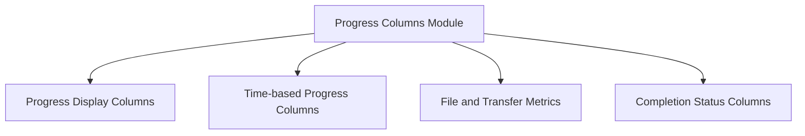

# Progress Columns Module

## Introduction

The `progress_columns` module is a vital part of the `rich.progress` library, providing a rich set of column types designed to display dynamic and informative progress updates. These columns are used in conjunction with the `rich.progress.Progress` class to visualize various aspects of a task, including progress bars, text, spinners, file transfer metrics, and time-based information. This module allows developers to create highly customizable and visually appealing progress displays in their applications.

## Architecture Overview

The `progress_columns` module functions as a collection of specialized `ProgressColumn` implementations. Each sub-module within `progress_columns` groups related column types, making it easy to manage and extend. These columns are integrated into the overall `rich.progress.Progress` system, where they are responsible for rendering specific pieces of information within the progress display.

<!-- DIAGRAM_JSON
{
    "direction": "TD",
    "nodes": [
        {"id": "display_columns", "label": "Progress Display Columns", "type": "module", "link": "display_columns.md"},
        {"id": "duration_columns", "label": "Time-based Progress Columns", "type": "module", "link": "duration_columns.md"},
        {"id": "file_metrics_columns", "label": "File and Transfer Metrics", "type": "module", "link": "file_metrics_columns.md"},
        {"id": "status_columns", "label": "Completion Status Columns", "type": "module", "link": "status_columns.md"}
    ],
    "edges": [
        {"source": "progress_columns", "target": "display_columns"},
        {"source": "progress_columns", "target": "duration_columns"},
        {"source": "progress_columns", "target": "file_metrics_columns"},
        {"source": "progress_columns", "target": "status_columns"}
    ],
    "groups": []
}
-->

## Sub-modules

### [Progress Display Columns](display_columns.md)
This sub-module contains columns responsible for general progress visualization, including spinners, progress bars, and custom text displays.

### [Time-based Progress Columns](duration_columns.md)
This sub-module provides columns that show elapsed time and estimated time remaining for a task, crucial for understanding task duration.

### [File and Transfer Metrics](file_metrics_columns.md)
This sub-module focuses on columns displaying file-related metrics such as file sizes, total file sizes, download progress, and transfer speeds, essential for file operations.

### [Completion Status Columns](status_columns.md)
This sub-module includes columns that indicate the completion status of a task, such as 'M of N' completed items, providing a clear overview of task progress.
