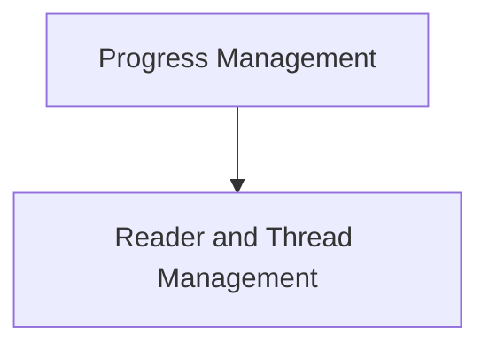

# Progress Core Module

## Introduction

The `progress_core` module is a fundamental component of the Rich library, responsible for managing and displaying the progress of long-running operations. It provides the core structures and logic for tracking tasks, updating their status, and collecting progress samples for rendering.

## Architecture Overview

The `progress_core` module is designed to be extensible, allowing for various progress display columns and custom rendering. It primarily consists of two key functional areas: **Progress Management** and **Reader and Thread Management**.

- **Progress Management**: This sub-module handles the creation, updating, and sampling of individual progress tasks, as well as the overall progress display logic. See [progress_management.md](progress_management.md) for more details.
- **Reader and Thread Management**: This sub-module focuses on the underlying mechanisms for reading data and managing dedicated threads to track and report progress, particularly useful for I/O-bound operations. See [reader_threads.md](reader_threads.md) for more details.

## Module Relationships

<!-- DIAGRAM_JSON
{
    "direction": "TD",
    "nodes": [
        {"id": "progress_management", "label": "Progress Management", "type": "module", "link": "progress_management.md"},
        {"id": "reader_threads", "label": "Reader and Thread Management", "type": "module", "link": "reader_threads.md"}
    ],
    "edges": [
        {"source": "progress_management", "target": "reader_threads"}
    ],
    "groups": []
}
-->

