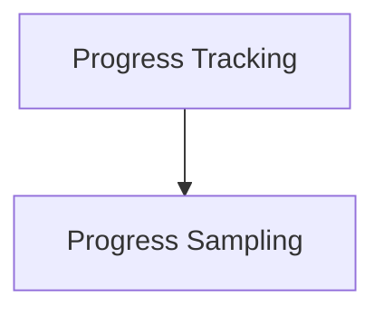

# Progress Management Module

The `progress_management` module is responsible for orchestrating and displaying progress information within applications. It provides the core components for defining progress tasks, tracking their status, and collecting samples for visual representation.

## Architecture Overview

This module is structured into key sub-modules that handle distinct aspects of progress management, from defining individual tasks to sampling progress data.

<!-- DIAGRAM_JSON
{
    "direction": "TD",
    "nodes": [
        {"id": "progress_tracking", "label": "Progress Tracking", "type": "module", "link": "progress_tracking.md"},
        {"id": "progress_sampling", "label": "Progress Sampling", "type": "module", "link": "progress_sampling.md"}
    ],
    "edges": [
        {"source": "progress_tracking", "target": "progress_sampling"}
    ],
    "groups": []
}
-->

## Sub-modules

### [Progress Tracking](progress_tracking.md)

This sub-module provides the foundational elements for defining and managing progress. It includes components like `Task` for individual units of work and `Progress` for overall progress orchestration.

### [Progress Sampling](progress_sampling.md)

The `progress_sampling` sub-module focuses on collecting and handling `ProgressSample` data, which is crucial for displaying real-time progress updates and historical trends.
