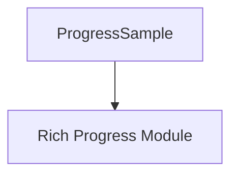

# progress_sampling

The `progress_sampling` module is a vital component within the `rich` library's progress display system. It is specifically designed to capture and store a snapshot of the current state of a progress task, facilitating the rendering of dynamic progress bars and statistics.

## Purpose and Core Functionality

The primary purpose of `progress_sampling` is to encapsulate the `ProgressSample` class, which serves as a data container for a single moment in time regarding a progress task's status. This snapshot includes critical information such as the task's completed amount, total amount, and current speed, enabling the `rich` library to accurately calculate and display progress.

The `ProgressSample` component is essential for:
*   **State Capture:** Recording the current progress metrics of a task at a specific point in time.
*   **Progress Calculation:** Providing the necessary data for `rich.progress` to compute statistics like estimated time remaining, percentage complete, and transfer speed.
*   **Thread Safety:** Designed to be used in multi-threaded environments where progress updates can occur asynchronously.

## Architecture and Component Relationships

The `progress_sampling` module is a leaf module primarily comprising the `ProgressSample` class. It plays a supporting role within the broader `rich_progress` system, particularly in how progress information is collected and used for rendering.

The `ProgressSample` object typically holds data derived from `Task` objects managed by a `Progress` instance. It doesn't actively manage tasks or progress display itself but provides the fundamental data structure required for these operations.

<!-- DIAGRAM_JSON
{
    "direction": "TD",
    "nodes": [
        {"id": "progress_sample", "label": "ProgressSample", "type": "component", "link": null},
        {"id": "rich_progress", "label": "Rich Progress Module", "type": "external", "link": "rich_progress.md"}
    ],
    "edges": [
        {"source": "progress_sample", "target": "rich_progress"}
    ],
    "groups": []
}
-->

## How the Module Fits into the Overall System

The `progress_sampling` module, through its `ProgressSample` component, acts as a critical data carrier within the `rich_progress` ecosystem. When a `Progress` object needs to update its display, it requests a `ProgressSample` from its active `Task` objects. These samples are then used by various `ProgressColumn` renderables (defined in `rich_progress`) to format and display real-time progress information to the console.

It provides the raw data necessary for all dynamic progress bar elements, ensuring that the displayed information is consistent and up-to-date with the underlying task's state. It is a foundational element that supports the visual feedback of ongoing operations within the `rich` library.