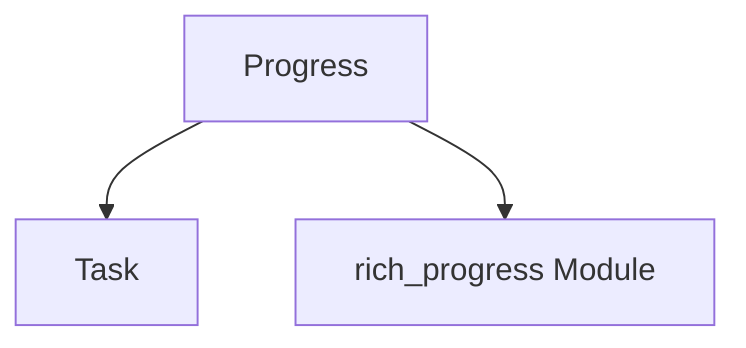

# Module: progress_tracking

## Introduction

The `progress_tracking` module is a core component within the larger `rich_progress` system, specifically focusing on the management and representation of individual progress tasks and the overall progress display. It provides the fundamental building blocks for defining, updating, and rendering progress information in a user-friendly manner.

## Purpose and Core Functionality

This module encapsulates the essential logic for tracking progress. Its primary responsibilities include:

*   **Task Definition:** Defining individual units of work that can be monitored for progress, including their total work, completed work, and current status.
*   **Progress Management:** Orchestrating the display and updates of multiple tasks, ensuring a coherent and dynamic view of ongoing operations.

The key components, `Task` and `Progress`, work in tandem to achieve this:

*   **`Task`**: Represents a single, trackable unit of work. It holds information pertinent to a specific operation, such as its description, total steps, completed steps, speed, and remaining time.
*   **`Progress`**: Acts as the central orchestrator for one or more `Task` instances. It manages the rendering of progress bars, columns, and other visual elements that provide feedback on the state of the tracked tasks. It coordinates updates and ensures that the console display is refreshed efficiently.

## Architecture and Component Relationships

The `progress_tracking` module is a sub-module of `progress_management`, which is part of `progress_core` within the `rich_progress` module. It directly interacts with the core `rich_progress` module for rendering and display capabilities.

<!-- DIAGRAM_JSON
{
    "direction": "TD",
    "nodes": [
        {"id": "Task", "label": "Task", "type": "component", "link": null},
        {"id": "Progress", "label": "Progress", "type": "component", "link": null},
        {"id": "rich_progress", "label": "rich_progress Module", "type": "external", "link": "rich_progress.md"}
    ],
    "edges": [
        {"source": "Progress", "target": "Task"},
        {"source": "Progress", "target": "rich_progress"}
    ],
    "groups": []
}
-->

## How it Fits into the Overall System

The `progress_tracking` module is fundamental to the `rich_progress` system. It provides the high-level API for users to define and interact with progress bars and status indicators.

*   **`Task`** objects are created and managed by the `Progress` instance. They are the granular units that hold the actual progress data (e.g., `completed`, `total`).
*   **`Progress`** instances consume `Task` objects and use various `ProgressColumn` implementations (defined in the `progress_columns` sub-module of `rich_progress`) to render the visual representation of progress to the console.
*   The `rich_progress` module, at its higher level, integrates `Progress` with other Rich features like `Live` display to provide dynamic and interactive progress updates.

For a broader understanding of the progress display system, refer to the [rich_progress module documentation](rich_progress.md).