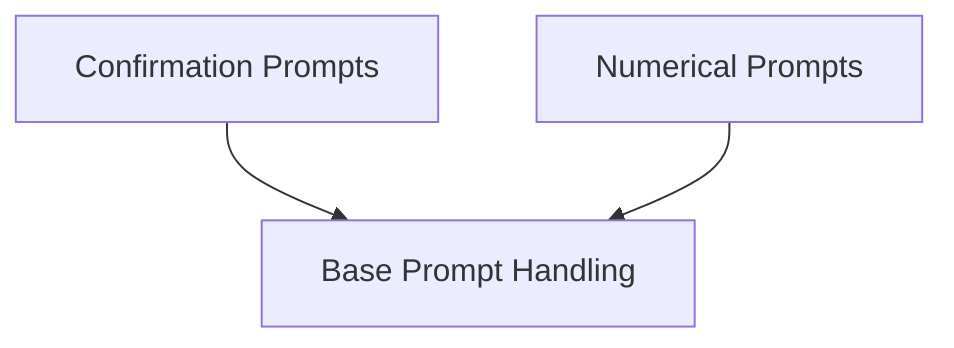

# Prompt Base Module Documentation

## Introduction

The `prompt_base` module in Rich provides a robust and flexible framework for creating interactive command-line prompts. It enables developers to easily solicit various types of input from users, including text, confirmations, integers, and floats, enhancing the interactivity and user experience of console applications.

This module abstracts the complexities of input handling, validation, and presentation, offering a streamlined API for common prompting scenarios. It forms the foundation for building dynamic and responsive command-line interfaces.

## Architecture

The `rich_prompt` module is structured into several key components, each responsible for a specific aspect of prompt management and user input. The core architecture revolves around a base prompt class, which is then extended to handle specific data types and interaction patterns. The module also integrates with other Rich components for rich text rendering and styling.

<!-- DIAGRAM_JSON
{
    "direction": "TD",
    "nodes": [
        {"id": "base_prompt_handling", "label": "Base Prompt Handling", "type": "module", "link": "base_prompt_handling.md"},
        {"id": "confirmation_prompts", "label": "Confirmation Prompts", "type": "module", "link": "confirmation_prompts.md"},
        {"id": "numerical_prompts", "label": "Numerical Prompts", "type": "module", "link": "numerical_prompts.md"}
    ],
    "edges": [
        {"source": "confirmation_prompts", "target": "base_prompt_handling"},
        {"source": "numerical_prompts", "target": "base_prompt_handling"}
    ],
    "groups": []
}
-->

## Sub-modules

This module is composed of the following sub-modules, each providing specialized functionalities:

*   **[Base Prompt Handling](base_prompt_handling.md)**: This sub-module contains the foundational classes, `Prompt` and `PromptBase`, which define the core mechanics and interface for all prompts within the Rich library. It handles the basic input/output operations, default styling, and common prompt behaviors.

*   **[Confirmation Prompts](confirmation_prompts.md)**: Dedicated to handling simple binary choices, this sub-module provides the `Confirm` class. It simplifies the process of asking yes/no questions to the user and interpreting their responses, often returning a boolean value.

*   **[Numerical Prompts](numerical_prompts.md)**: This sub-module includes specialized prompt classes such as `IntPrompt` and `FloatPrompt`. These classes are designed to robustly collect and validate numerical input from users, ensuring that the input conforms to integer or floating-point formats, respectively. They handle parsing and error feedback for invalid entries.
