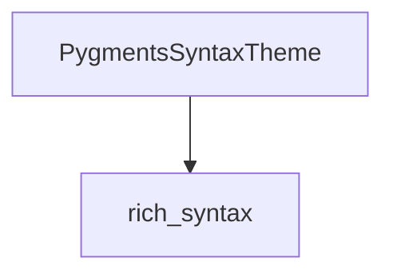

# `pygments_themes` Module Documentation

## Introduction

The `pygments_themes` module is a specialized component within the `rich` library, designed to integrate syntax highlighting themes from Pygments, a popular syntax highlighter. This module specifically provides the `PygmentsSyntaxTheme` class, enabling `rich` to render code snippets with styles defined by Pygments themes.

## Core Functionality

This module's primary purpose is to bridge the gap between Pygments' extensive collection of themes and `rich`'s rendering capabilities. By abstracting the specifics of Pygments themes, it allows for consistent and visually appealing code presentation across various platforms supported by `rich`.

## Architecture and Component Relationships

The `pygments_themes` module is a leaf module focusing on a single, yet crucial, component: `PygmentsSyntaxTheme`. This component plays a vital role in `rich`'s overall syntax highlighting architecture, primarily interacting with the `rich_syntax` module, which provides the foundational `SyntaxTheme` class and the `Syntax` renderable.

<!-- DIAGRAM_JSON
{
    "direction": "TD",
    "nodes": [
        {"id": "pygments_syntax_theme", "label": "PygmentsSyntaxTheme", "type": "component", "link": null},
        {"id": "rich_syntax", "label": "rich_syntax", "type": "external", "link": "rich_syntax.md"}
    ],
    "edges": [
        {"source": "pygments_syntax_theme", "target": "rich_syntax"}
    ],
    "groups": []
}
-->

### `rich_syntax.PygmentsSyntaxTheme`

The `PygmentsSyntaxTheme` class is the core component of this module. It is responsible for adapting Pygments `Theme` objects into a format that `rich` can use for syntax highlighting. This typically involves translating Pygments' style definitions (colors, bold, italic, etc.) into `rich.style.Style` objects.

For more detailed information on the base syntax theme and the `Syntax` renderable, refer to the [rich_syntax module documentation](rich_syntax.md).

## How it Fits into the Overall System

`pygments_themes` is an integral part of `rich`'s code rendering capabilities. When a user specifies a Pygments theme for syntax highlighting (e.g., in `rich.syntax.Syntax`), the `PygmentsSyntaxTheme` component is leveraged to apply the chosen theme's styling to the code. This ensures that `rich` can offer a wide range of visually distinct and user-preferred code presentations, directly benefiting from the rich ecosystem of Pygments themes.