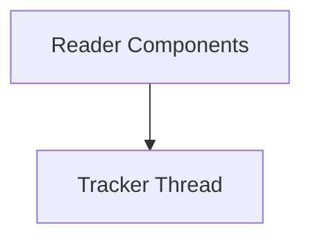

# Reader Threads Module

## Introduction
The `reader_threads` module is an integral part of the `rich_progress` system, specifically designed to handle background data reading and progress tracking operations. It encapsulates the logic for efficiently reading various data sources and maintaining real-time updates for progress bars.

## Architecture Overview
The `reader_threads` module is composed of two primary sub-modules: `reader_components` and `tracker_thread`. The `reader_components` module provides the core functionalities for reading data and managing the read context, while the `tracker_thread` module is responsible for orchestrating the background thread that continuously tracks and updates the progress state. This clear separation of concerns ensures efficient and responsive progress reporting without blocking the main application thread.

<!-- DIAGRAM_JSON
{
    "direction": "TD",
    "nodes": [
        {"id": "reader_components", "label": "Reader Components", "type": "module", "link": "reader_components.md"},
        {"id": "tracker_thread", "label": "Tracker Thread", "type": "module", "link": "tracker_thread.md"}
    ],
    "edges": [
        {"source": "reader_components", "target": "tracker_thread"}
    ],
    "groups": []
}
-->

## High-level Functionality of Sub-modules:

*   **[Reader Components](reader_components.md)**: This sub-module contains the foundational elements for reading data streams and managing the context of these read operations. It includes the `_Reader` for abstracting data reading and `_ReadContext` for maintaining the state of the current read.
*   **[Tracker Thread](tracker_thread.md)**: This sub-module manages a dedicated thread (`_TrackThread`) that continuously monitors the progress of read operations and dispatches updates to the `rich_progress` system. It ensures that progress bars and indicators are always current and responsive.
