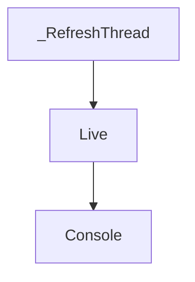

# `refresh_thread` Module Documentation

The `refresh_thread` module, a sub-module of `rich_live`, encapsulates the `_RefreshThread` component. This component is crucial for enabling dynamic, live updates within Rich applications by managing a dedicated background thread that periodically refreshes the displayed content.

## Purpose and Core Functionality

The primary purpose of the `refresh_thread` module is to provide a non-blocking mechanism for updating `Live` displays. The `_RefreshThread` class acts as a daemon thread that, when active, signals its associated `Live` object to redraw itself at a specified interval. This ensures that interactive elements, progress bars, or any other dynamic output can update smoothly in the terminal without requiring manual intervention from the main application logic, thus improving user experience and application responsiveness.

Key functionalities include:
*   **Background Refresh**: Operates in a separate thread to avoid freezing the main application.
*   **Timed Updates**: Refreshes the `Live` display at a configurable interval.
*   **Synchronization**: Coordinates with the `Live` object to ensure safe and consistent updates.

## Architecture and Component Relationships

The `_RefreshThread` is a core internal component designed to work in conjunction with the `Live` display manager. It maintains a reference to the `Live` instance it serves and uses threading primitives to control its update cycle.

<!-- DIAGRAM_JSON
{
    "direction": "TD",
    "nodes": [
        {"id": "refresh_thread", "label": "_RefreshThread", "type": "component", "link": null},
        {"id": "live_display", "label": "Live", "type": "external", "link": "live_display.md"},
        {"id": "rich_console", "label": "Console", "type": "external", "link": "rich_console.md"}
    ],
    "edges": [
        {"source": "refresh_thread", "target": "live_display"},
        {"source": "live_display", "target": "rich_console"}
    ],
    "groups": []
}
-->

## How the Module Fits into the Overall System

The `refresh_thread` module is an integral part of Rich's `live` display system. It provides the underlying threading mechanism that powers the `Live` context manager, allowing developers to easily create dynamically updating terminal UIs. It abstracts away the complexities of managing background threads for refreshing content, making the `Live` API intuitive and efficient.

It interacts closely with:
*   **`live_display` (rich_live.Live)**: The `_RefreshThread` directly controls the refresh cycle of a `Live` instance.
*   **`rich_console` (Console)**: The `Live` object, in turn, uses the `Console` to render its updated content to the terminal.

By isolating the refresh logic into a dedicated thread, `refresh_thread` ensures that Rich can deliver responsive and interactive experiences without impacting the main application's performance.
