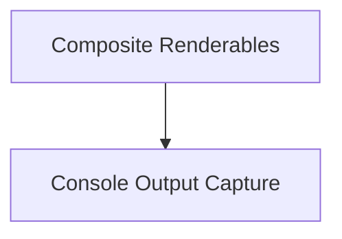

# Renderable Elements Module

## Introduction

The `renderable_elements` module, part of the `rich_console` package, provides core components for structuring and managing how content is rendered in the Rich console. It includes utilities for grouping multiple renderables, inserting newlines, and capturing console output for programmatic use.

## Architecture

This module is structured into two main sub-modules:

*   **Composite Renderables**: Handles the aggregation and arrangement of multiple renderable components.
*   **Output Capture**: Manages the capturing of rendered console content.

<!-- DIAGRAM_JSON
{
    "direction": "TD",
    "nodes": [
        {"id": "composite_renderables", "label": "Composite Renderables", "type": "module", "link": "composite_renderables.md"},
        {"id": "output_capture", "label": "Console Output Capture", "type": "module", "link": "output_capture.md"}
    ],
    "edges": [
        {"source": "composite_renderables", "target": "output_capture"}
    ],
    "groups": []
}
-->

## Sub-modules

### [Composite Renderables](composite_renderables.md)

This sub-module contains classes like `Group` and `NewLine`, which are fundamental for combining and formatting multiple renderable components within the Rich console output.

### [Output Capture](output_capture.md)

The `output_capture` sub-module provides the `Capture` class, enabling developers to programmatically capture and inspect the text rendered by the Rich console, which is invaluable for testing, logging, or redirecting output.
