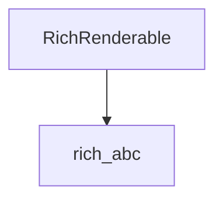

# renderable_interfaces

The `renderable_interfaces` module defines the fundamental interfaces that objects must implement to be rendered by the Rich library's console. It primarily exposes the `RichRenderable` abstract base class, which is crucial for integrating custom objects into Rich's rendering pipeline.

## Purpose and Core Functionality

The primary purpose of `renderable_interfaces` is to provide a standardized interface for any object that wishes to be rendered by a Rich `Console`. This module makes the `RichRenderable` interface available, which dictates that an object must implement the `__rich_console__(self, console, options)` method.

This method is the entry point for Rich's rendering process, allowing objects to define how they should be represented when printed to the console. By adhering to this interface, developers can create custom renderable components that seamlessly integrate with Rich's layout, styling, and rendering capabilities.

## Architecture and Component Relationships

The `renderable_interfaces` module serves as a public-facing interface for the `RichRenderable` definition which is internally managed and defined within the `rich_abc` module. This module essentially re-exports or provides access to this critical interface, making it easily discoverable and usable throughout the Rich ecosystem without direct dependency on `rich_abc` for consumers.

<!-- DIAGRAM_JSON
{
    "direction": "TD",
    "nodes": [
        {"id": "rich_renderable", "label": "RichRenderable", "type": "component", "link": null},
        {"id": "rich_abc", "label": "rich_abc", "type": "external", "link": "rich_abc.md"}
    ],
    "edges": [
        {"source": "rich_renderable", "target": "rich_abc"}
    ],
    "groups": []
}
-->

## How the Module Fits into the Overall System

The `renderable_interfaces` module is a cornerstone of the Rich library's extensibility. Any component, whether built-in or custom, that needs to display content on the Rich `Console` will ultimately rely on the `RichRenderable` interface.

It acts as a contract between renderable objects and the `Console` (defined in [rich_console.md](rich_console.md)). When the `Console` needs to render an object, it checks for the `__rich_console__` method, defined by `RichRenderable`. This allows for a polymorphic approach to rendering, where various types of objects can be treated uniformly by the console. This interface enables:

*   **Custom Object Rendering**: Developers can implement `__rich_console__` in their classes to control how instances are displayed.
*   **Interoperability**: Ensures that different Rich components (e.g., `Panel`, `Table`, `Syntax`) can all be rendered consistently by the `Console`.
*   **Flexible Output**: Facilitates features like automatic word wrapping, styling, and console dimension awareness, as the `console` and `options` arguments provide context during rendering.
