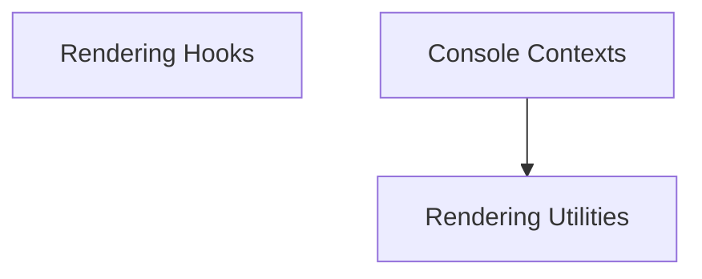

# Rendering and Hooks Module

## Introduction
The `rendering_and_hooks` module provides essential components for managing how content is rendered to the console and offers various hooks and contexts to customize the rendering process within the Rich library. It encompasses tools for handling screen updates, defining rendering contexts, and integrating custom rendering logic.

## Architecture Overview
This module is structured around several key components that facilitate flexible and extensible console output. It interacts closely with the core console components to provide a rich and dynamic rendering experience.

<!-- DIAGRAM_JSON
{
    "direction": "TD",
    "nodes": [
        {"id": "rendering_hooks", "label": "Rendering Hooks", "type": "module", "link": "rendering_hooks.md"},
        {"id": "console_contexts", "label": "Console Contexts", "type": "module", "link": "console_contexts.md"},
        {"id": "rendering_utilities", "label": "Rendering Utilities", "type": "module", "link": "rendering_utilities.md"}
    ],
    "edges": [
        {"source": "console_contexts", "target": "rendering_utilities"}
    ],
    "groups": []
}
-->

## Sub-modules

### [Rendering Hooks](rendering_hooks.md)
This sub-module defines the `RenderHook` interface, allowing developers to inject custom logic into the rendering pipeline of the Rich console.

### [Console Contexts](console_contexts.md)
This sub-module manages the various contextual states crucial for rendering, including `ScreenContext`, `PagerContext`, and `ThemeContext`, which dictate how content is displayed and styled.

### [Rendering Utilities](rendering_utilities.md)
This sub-module provides utility classes such as `ScreenUpdate`, `NoChange`, and `RichCast` to facilitate efficient screen updates, signal render skips, and enable type casting for Rich renderables.
