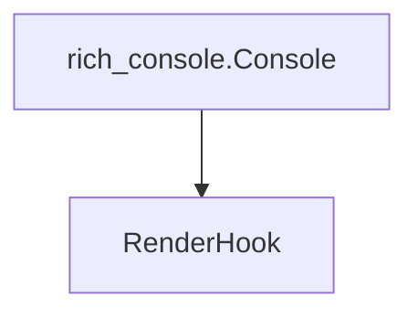

# rendering_hooks Module Documentation

## Introduction

The `rendering_hooks` module, part of the larger `rich_console` ecosystem, provides a crucial mechanism for extending and customizing the rendering behavior of the Rich library. Its primary component, `RenderHook`, allows developers to inject custom logic into the console's rendering pipeline, enabling advanced control over how renderables are processed and displayed.

## Architecture and Core Components

The `rendering_hooks` module is focused solely on the `RenderHook` abstract base class (or interface). It is designed to be implemented by custom classes that need to intervene in the rendering process of the `rich.console.Console`.

### rich_console.RenderHook

The `RenderHook` is an interface that defines methods to be called at specific points during the console's rendering cycle. By implementing this interface and registering an instance with a `Console`, developers can modify, replace, or react to renderables before or after they are processed by the console.

### Relationship to rich_console

This module is tightly integrated with the `rich_console` module. The `Console` class in `rich_console` is responsible for managing and invoking `RenderHook` instances. For more details on the `Console` and its rendering process, refer to the [rich_console module documentation](rich_console.md).

<!-- DIAGRAM_JSON
{
    "direction": "TD",
    "nodes": [
        {"id": "render_hook", "label": "RenderHook", "type": "component", "link": null},
        {"id": "rich_console", "label": "rich_console.Console", "type": "external", "link": "rich_console.md"}
    ],
    "edges": [
        {"source": "rich_console", "target": "render_hook"}
    ],
    "groups": []
}
-->

