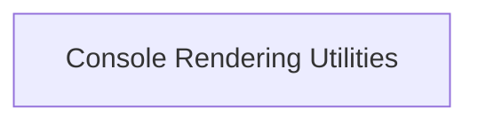

# Rendering Utilities Module

The `rendering_utilities` module provides essential utility classes that facilitate screen updates and control rendering behavior within the Rich console environment. It ensures efficient and effective visual output by managing how changes are presented to the user.

## Architecture

The `rendering_utilities` module is a core part of the Rich console's rendering process, primarily interacting with the console and its various components to control display updates and rendering logic.

<!-- DIAGRAM_JSON
{
    "direction": "TD",
    "nodes": [
        {"id": "console_rendering_utilities", "label": "Console Rendering Utilities", "type": "module", "link": "console_rendering_utilities.md"}
    ],
    "edges": [],
    "groups": []
}
-->

## Sub-modules

### [Console Rendering Utilities](console_rendering_utilities.md)

This sub-module contains core components such as `ScreenUpdate`, `NoChange`, and `RichCast`, which are fundamental for handling console screen updates, signaling no-change conditions, and casting objects to renderable forms. It directly contributes to the dynamic and responsive nature of the Rich console's output.
