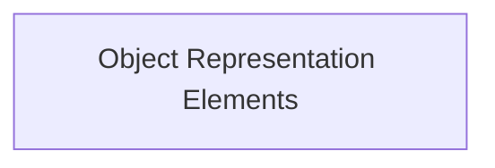

# Representation Objects Module

The `representation_objects` module is a crucial part of the `rich_pretty` package, focusing on defining fundamental elements for representing Python objects, especially within the context of pretty printing. It provides basic building blocks for constructing visual representations, including mechanisms to handle cases where an object's representation might be simplified or "broken" for display purposes.

## Architecture

This module primarily consists of core components that serve as foundational types for more complex pretty printing logic within the `rich_pretty` system. It directly contributes to how `rich` renders various Python objects in a user-friendly and readable format.

<!-- DIAGRAM_JSON
{
    "direction": "TD",
    "nodes": [
        {"id": "object_representation_elements", "label": "Object Representation Elements", "type": "module", "link": "object_representation_elements.md"}
    ],
    "edges": [

    ],
    "groups": []
}
-->

## Sub-modules

*   ### [Object Representation Elements](object_representation_elements.md)
    Defines core elements for representing objects, including handling broken or simplified representations within the pretty printing system.