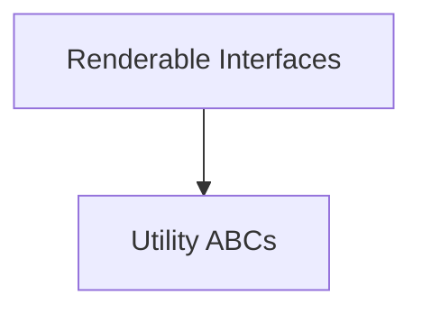

# `rich_abc` Module Documentation

## Introduction and Purpose

The `rich_abc` module in the Rich library defines essential Abstract Base Classes (ABCs) that serve as foundational interfaces for various renderable objects and internal utilities. These ABCs establish contracts that concrete implementations must adhere to, promoting consistency and extensibility throughout the Rich ecosystem. This module is critical for ensuring that different components can interact seamlessly by conforming to defined interfaces.

## Architecture Overview

The `rich_abc` module is structured into two main sub-modules, which organize the core abstract interfaces:

<!-- DIAGRAM_JSON
{
    "direction": "TD",
    "nodes": [
        {"id": "renderable_interfaces", "label": "Renderable Interfaces", "type": "module", "link": "renderable_interfaces.md"},
        {"id": "utility_abcs", "label": "Utility ABCs", "type": "module", "link": "utility_abcs.md"}
    ],
    "edges": [
        {"source": "renderable_interfaces", "target": "utility_abcs"}
    ],
    "groups": []
}
-->

## High-level Functionality

### Renderable Interfaces (`renderable_interfaces.md`)
This sub-module primarily defines `RichRenderable`, an abstract base class that establishes the contract for any object intended to be rendered by a Rich `Console`. It specifies the methods and properties that a class must implement to be considered "renderable," ensuring that the console can process and display it correctly.

### Utility ABCs (`utility_abcs.md`)
This sub-module contains `Foo`, which serves as a placeholder or a base for other internal abstract classes within Rich. While `Foo` itself might be a simple example, similar ABCs in this category would define interfaces for various internal helper components or functionalities that require a standardized structure.
