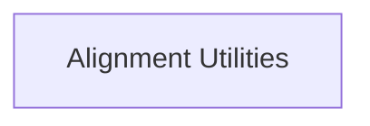

# rich_align Module Documentation

The `rich_align` module provides foundational classes for controlling the alignment of renderable content within the terminal. It offers utilities for both horizontal and vertical positioning, enabling developers to create visually organized and aesthetically pleasing terminal interfaces.

## Architecture Overview

The `rich_align` module is composed of core alignment utilities, which can be integrated with other Rich components to achieve desired layout effects. Its primary function is to wrap existing Rich renderables and apply specific alignment rules.

<!-- DIAGRAM_JSON
{
    "direction": "TD",
    "nodes": [
        {"id": "alignment_utilities", "label": "Alignment Utilities", "type": "module", "link": "alignment_utilities.md"}
    ],
    "edges": [],
    "groups": []
}
-->

## Sub-modules

### [Alignment Utilities](alignment_utilities.md)
This sub-module contains the core logic for aligning content. It includes classes like `Align` for general horizontal alignment and `VerticalCenter` for specific vertical centering needs.