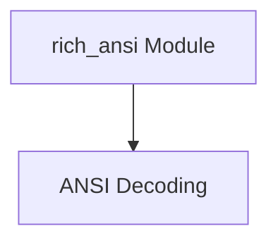

# rich_ansi Module Documentation

## Introduction
The `rich_ansi` module is responsible for parsing and interpreting ANSI escape codes found in text, converting them into Rich-compatible renderable segments. This allows Rich to correctly display styled and colored text that originates from systems or applications emitting ANSI sequences.

## Architecture Overview
The `rich_ansi` module primarily consists of components that handle the tokenization and decoding of ANSI strings. The `ansi_decoding` sub-module encapsulates the logic for processing these escape codes.

<!-- DIAGRAM_JSON
{
    "direction": "TD",
    "nodes": [
        {"id": "ansi_decoding", "label": "ANSI Decoding", "type": "module", "link": "ansi_decoding.md"}
    ],
    "edges": [],
    "groups": []
}
-->

## Sub-modules
*   [ANSI Decoding](ansi_decoding.md): Manages the conversion of raw ANSI strings into structured Rich elements.