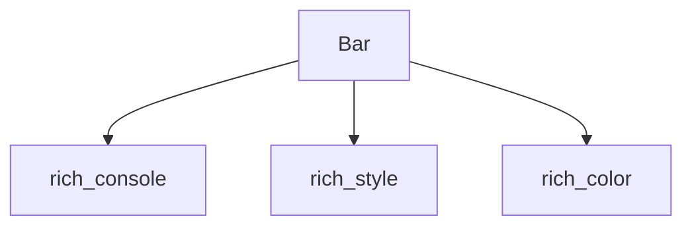

# rich_bar Module Documentation

## Introduction

The `rich_bar` module provides the `Bar` renderable, a fundamental component for visually representing progress, proportions, or values within the Rich library. It is designed to be highly customizable, allowing developers to create informative and aesthetically pleasing bar elements for various console applications.

### Purpose

The primary purpose of `rich_bar` is to offer a straightforward and efficient way to render horizontal bar graphics in the terminal. These bars can be used to indicate:
*   **Progress:** Such as in a download, installation, or long-running process.
*   **Ratios/Proportions:** Displaying the distribution of different categories.
*   **Numerical values:** Visualizing data points within a defined range.

### Core Functionality

The `rich_bar` module's core functionality is encapsulated within the `Bar` class. This class allows for the creation of a customizable bar, specifying its length, completed portion, total value, and visual style. It integrates seamlessly with the Rich console for rendering.

## Architecture

The `rich_bar` module is a leaf module focusing solely on the `Bar` component. Its architecture is simple, with the `Bar` class being the central element.

### Component Relationships

*   **Bar:** The sole internal component, responsible for encapsulating the logic and rendering details of a bar.
*   **rich_console:** The `Bar` component relies on the `rich_console` module for its rendering capabilities, drawing the bar to the console output.
*   **rich_style:** Styling of the bar, including colors and text attributes, is managed through the `rich_style` module.
*   **rich_color:** Specific color definitions used within the bar's appearance are provided by the `rich_color` module.

### Integration with other modules

The `rich_bar` module, specifically its `Bar` component, is designed to be easily integrated into larger Rich applications. It is frequently used in conjunction with:
*   **rich_progress:** To visually represent the progress of tasks (e.g., `ProgressBar` from `rich_progress_bar` likely uses `Bar`).
*   **rich_columns** or **rich_table:** To embed bars within more complex layouts or tables for data visualization.

<!-- DIAGRAM_JSON
{
    "direction": "TD",
    "nodes": [
        {"id": "bar", "label": "Bar", "type": "component", "link": null},
        {"id": "rich_console", "label": "rich_console", "type": "external", "link": "rich_console.md"},
        {"id": "rich_style", "label": "rich_style", "type": "external", "link": "rich_style.md"},
        {"id": "rich_color", "label": "rich_color", "type": "external", "link": "rich_color.md"}
    ],
    "edges": [
        {"source": "bar", "target": "rich_console"},
        {"source": "bar", "target": "rich_style"},
        {"source": "bar", "target": "rich_color"}
    ],
    "groups": []
}
-->

