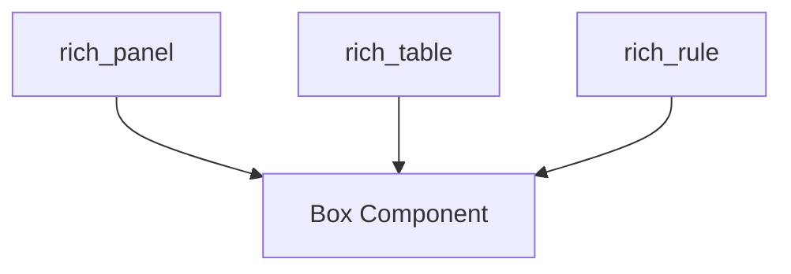

# rich_box Module Documentation

The `rich_box` module provides the foundational `Box` component, which defines various styles for drawing borders and frames around content. It serves as a crucial utility for creating visually structured output in the Rich library, enabling other components to render distinct boundaries, panels, and tables.

## Core Functionality

The primary component within `rich_box` is `Box`. This class encapsulates different sets of Unicode characters (or ASCII alternatives) required to draw various types of boxes, such as single lines, double lines, rounded corners, heavy lines, and more. By abstracting these character sets, `rich_box` allows for consistent and themeable border rendering across the entire Rich ecosystem.

## Architecture and Component Relationships

The `rich_box` module, specifically its `Box` component, acts as a foundational utility. Other modules within the Rich library depend on `Box` to render visual structures. This promotes reusability and ensures a consistent look and feel for bordered elements.

Internal Components:
*   `Box`: Defines the character sets for various box styles (e.g., `Box.SQUARE`, `Box.ROUNDED`, `Box.DOUBLE`).

External Dependencies (Modules that utilize `rich_box`):
*   [`rich_panel`](rich_panel.md): The `Panel` component uses `Box` to draw its borders.
*   [`rich_table`](rich_table.md): The `Table` component uses `Box` to draw its table borders and separators.
*   [`rich_rule`](rich_rule.md): The `Rule` component might use `Box` characters for its line drawing.

## How it Fits into the Overall System

`rich_box` is a low-level, high-impact module that underpins the visual presentation of many higher-level Rich components. By centralizing the definition of box drawing characters, it allows for easy customization and thematic changes across the entire library. When a user changes the style of a panel or table border, it's often the `Box` component (or a derivative of its predefined styles) that is being referenced and applied.

<!-- DIAGRAM_JSON
{
    "direction": "TD",
    "nodes": [
        {"id": "box_component", "label": "Box Component", "type": "component", "link": null},
        {"id": "rich_panel", "label": "rich_panel", "type": "external", "link": "rich_panel.md"},
        {"id": "rich_table", "label": "rich_table", "type": "external", "link": "rich_table.md"},
        {"id": "rich_rule", "label": "rich_rule", "type": "external", "link": "rich_rule.md"}
    ],
    "edges": [
        {"source": "rich_panel", "target": "box_component"},
        {"source": "rich_table", "target": "box_component"},
        {"source": "rich_rule", "target": "box_component"}
    ],
    "groups": []
}
-->
