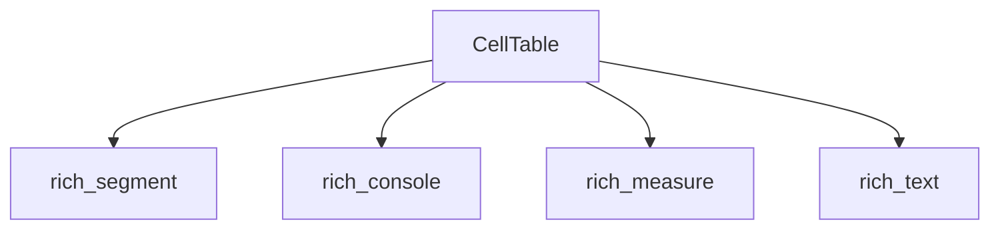

# rich_cells Module Documentation

The `rich_cells` module provides fundamental utilities for managing and rendering individual character cells within the Rich terminal rendering system. Its primary component, `CellTable`, is designed to efficiently handle a grid of cells, forming the basis for more complex layout and tabular structures.

## Purpose and Core Functionality

The core purpose of `rich_cells` is to offer a low-level abstraction for working with terminal cells. This includes:

*   **Cell Management**: Providing a structure to store and access individual cells in a grid-like fashion.
*   **Layout Foundation**: Serving as a building block for rendering components that require precise cell-based positioning, such as tables and panels.

### Core Components

#### `CellTable`

The `CellTable` class is the central component of this module. It represents a two-dimensional grid of cells, allowing for efficient manipulation and rendering of content at a granular level. While its direct use might be internal to the Rich library, it underpins the functionality of higher-level components that display structured output.

## Architecture and Component Relationships

The `rich_cells` module, primarily through its `CellTable` component, interacts with other core Rich modules to achieve its functionality. It acts as a foundational layer, consuming rendering primitives and providing structured cell data to the console.

`CellTable` likely depends on:

*   [`rich_segment`](rich_segment.md): To handle the low-level rendering segments that constitute the content of each cell.
*   [`rich_console`](rich_console.md): To interface with the console rendering context and output mechanism.
*   [`rich_measure`](rich_measure.md): For calculating and managing the dimensions and width of cells and their content.
*   [`rich_text`](rich_text.md): For handling the textual content that resides within individual cells.

## How the Module Fits into the Overall System

`rich_cells` is a foundational utility within the Rich ecosystem. It provides the basic grid structure that allows higher-level components like `rich_table`, `rich_layout`, and `rich_panel` to arrange and display their content accurately in the terminal. Without `CellTable`, the precise alignment and rendering of complex structures would be significantly more challenging.

## Diagram

<!-- DIAGRAM_JSON
{
    "direction": "TD",
    "nodes": [
        {"id": "cell_table", "label": "CellTable", "type": "component", "link": null},
        {"id": "rich_segment", "label": "rich_segment", "type": "external", "link": "rich_segment.md"},
        {"id": "rich_console", "label": "rich_console", "type": "external", "link": "rich_console.md"},
        {"id": "rich_measure", "label": "rich_measure", "type": "external", "link": "rich_measure.md"},
        {"id": "rich_text", "label": "rich_text", "type": "external", "link": "rich_text.md"}
    ],
    "edges": [
        {"source": "cell_table", "target": "rich_segment"},
        {"source": "cell_table", "target": "rich_console"},
        {"source": "cell_table", "target": "rich_measure"},
        {"source": "cell_table", "target": "rich_text"}
    ],
    "groups": []
}
-->
